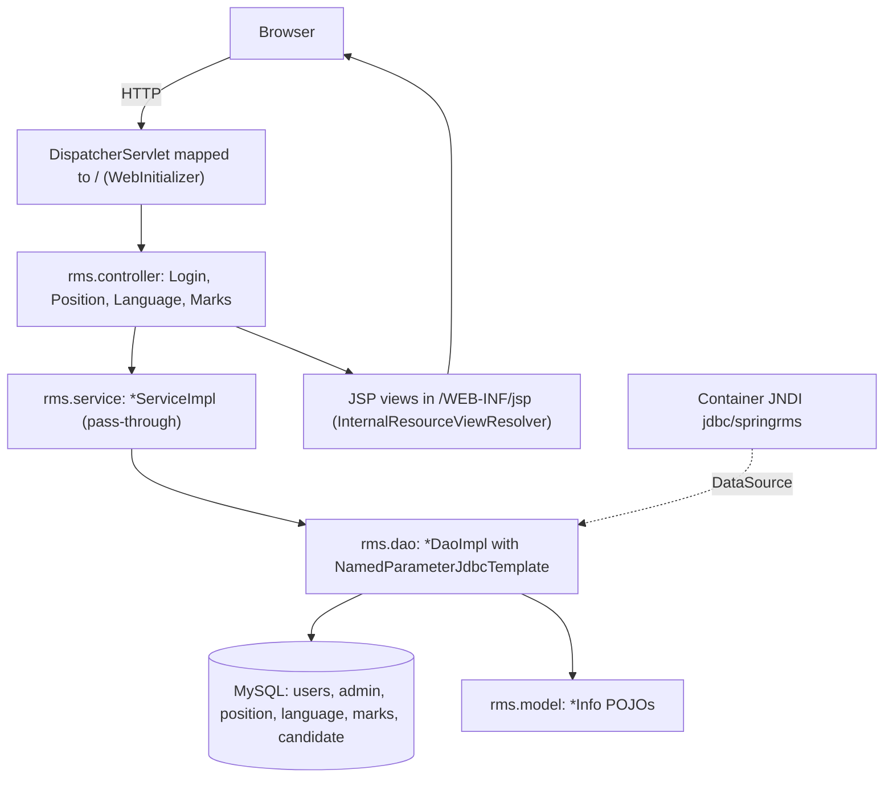

# RMS — Recruitment Management System

Detailed request traces are in [docs/architecture.md](docs/architecture.md).

## Project Summary
- RMS is a small web app for managing recruitment (`README.md`: "Simple Recruitment Management System").
- It has two user roles, chosen by `UserInfo.isinterviewer` (`main.jsp`): admins (`N`) and interviewers (`Y`).
- Admins maintain the job-position and language/skill lists (`PositionController`, `LanguageController`). They also view each candidate's interview scores across 10 criteria, with a total and a selected/rejected status (`MarksController`, `viewmarks.jsp`).
- It's a single Maven WAR module: Spring MVC with JSP views and JDBC against MySQL. There are 26 Java files and about 1.9k lines of Java and JSP (`pom.xml`, `src/main/`).

## Tech Stack (Confirmed)
| Layer | Technology | Version | Evidence |
|---|---|---|---|
| Language/JDK | Java. Not set in `pom.xml`; Eclipse is set to 1.5 | — | `pom.xml`, `.settings/org.eclipse.jdt.core.prefs` |
| Build | Maven with `maven-war-plugin`. `mvn package` builds the WAR | 2.3 | `pom.xml` |
| Runtime | External Servlet 3.1 container, started by `WebInitializer` (no `main()`) | Servlet API 3.1.0 (provided) | `pom.xml`, `rms/config/WebInitializer.java` |
| Web/UI | JSP with scriptlets, JSTL, Spring tags, Bootstrap, jQuery, DataTables (from CDNs) | JSTL 1.2 | `pom.xml`, `src/main/webapp/WEB-INF/jsp/*.jsp` |
| Framework | Spring MVC with Java config (`@EnableWebMvc`, `@ComponentScan("rms")`) | 4.3.0.RELEASE | `pom.xml`, `rms/config/WebConfig.java` |
| Persistence | Spring JDBC `NamedParameterJdbcTemplate` with hand-written SQL and `RowMapper`s, no ORM | 4.3.0.RELEASE | `WebConfig.java`, `rms/dao/*DaoImpl.java` |
| Database | MySQL, connection looked up by the name `java:comp/env/jdbc/springrms` | Connector/J 5.1.36 | `pom.xml`, `WebConfig.getDataSource` |
| Messaging/Integration | Not found | — | `pom.xml` |
| Scheduling/Batch | Not found | — | `src/main/java` (no `@Scheduled`) |
| Reporting | Not found | — | `pom.xml` |
| Logging | None; the code uses `System.out.println` | — | `LanguageDaoImpl.addLanguage`, `PositionDaoImpl.addPosition` |
| Security/Auth | Home-made SQL password check plus a session attribute `user`; no framework | — | `LoginController`, `LoginDaoImpl.checkUser` |
| Testing | Not found | — | No `src/test/`, no test dependencies in `pom.xml` |
| Packaging | WAR file (`rmsv2-1.0.1-SNAPSHOT`) | — | `pom.xml` |

## Business Flows (Confirmed)
Only flows that can be traced end to end in the code are listed here. Partial flows are under Open Questions.

| Capability | Description | Entry Point | Key Classes | DB Tables | Evidence |
|---|---|---|---|---|---|
| Login / session | Checks the username and password, loads the profile, and shows the menu for the user's role | `POST /welcome`, `GET /login` | `LoginController`, `LoginServiceImpl`, `LoginDaoImpl`, `UserInfo` | `users`, `admin` | `rms/controller/LoginController.java`, `rms/dao/LoginDaoImpl.java`, `main.jsp` |
| Position master | Create, list, rename and delete job positions (names in uppercase, duplicates skipped) | `/createposition`, `/saveposition`, `/viewpositionlist`, `/updateposition/{k}`, `/deleteposition/{k}` | `PositionController`, `PositionServiceImpl`, `PositionDaoImpl`, `PositionInfo` | `position` | `rms/controller/PositionController.java`, `rms/dao/PositionDaoImpl.java` |
| Language master | Create, list, rename and delete the languages/skills candidates are assessed on | `/createlanguage`, `/savelanguage`, `/viewlanguagelist`, `/updatelanguage/{k}`, `/deletelanguage/{k}` | `LanguageController`, `LanguageServiceImpl`, `LanguageDaoImpl`, `LanguageInfo` | `language` | `rms/controller/LanguageController.java`, `rms/dao/LanguageDaoImpl.java` |
| Candidate results (admin, read-only) | Lists every candidate's 10 scores, the total and the S/R status | `GET /adminviewmarks` | `MarksController`, `MarksServiceImpl`, `MarksDaoImpl`, `MarksInfo` | `marks`, `candidate`, `position`, `language`, `admin` | `rms/dao/MarksDaoImpl.java` (`getAllMarksByAdmin`), `viewmarks.jsp` |

No stored procedures are called anywhere (`rms/dao/*DaoImpl.java`).

## Technical Flow (Confirmed)

Evidence: `WebInitializer.java`, `WebConfig.java`, and the `rms/controller`, `rms/service`, `rms/dao` packages. There are no external integrations.

**Request lifecycle:**
1. A `@Controller` method with `@RequestMapping(value, method)` receives the request.
2. It calls a `@Service` `*ServiceImpl`, which just passes the call on.
3. The service calls a `@Repository` `*DaoImpl`, which runs SQL through `NamedParameterJdbcTemplate` and maps rows to `*Info` models.
4. The controller returns a `ModelAndView`, which resolves to `/WEB-INF/jsp/<view>.jsp`, or a `redirect:` after saves and deletes.
5. `main.jsp` is the page frame: each menu item loads its page inside an `<object>` element.

**Cross-cutting concerns:**
- **Transactions:** none. There's no `@Transactional` or transaction manager, even though `spring-tx` is a dependency (`pom.xml`, `src/main/java`).
- **Error handling:** no `@ExceptionHandler` or `@ControllerAdvice`. Only `EmptyResultDataAccessException` is caught, in `LoginDaoImpl.checkUser` and `*DaoImpl.add*`.
- **Logging:** only `System.out.println` (`LanguageDaoImpl`, `PositionDaoImpl`).
- **Security:** nothing checks the session after login. There's no filter or interceptor, and no controller reads the `user` attribute (`rms/controller/*`). The password is compared as plain text in SQL (`LoginDaoImpl`).
- **Validation:** none (no `@Valid` or `BindingResult`). The only checks are uppercase/trim and the duplicate-name check in the DAOs.
- **Deletes:** sent as GET requests and remove the row, even though an `isactive` column exists (`*DaoImpl.delete*`).

**Conventions:**
- Packages: `rms.{config, controller, service, dao, model}`.
- Each service and DAO is an interface plus an `*Impl` class; models are named `*Info`.
- Indentation is tabs. Eclipse TODO stubs are left in place.

## Business ↔ Tech Map
| Capability | Controller | Service | DAO | Model | View(s) |
|---|---|---|---|---|---|
| Login / session | `rms.controller.LoginController` | `rms.service.LoginServiceImpl` | `rms.dao.LoginDaoImpl` | `rms.model.UserInfo` | `login.jsp`, `main.jsp` |
| Position master | `rms.controller.PositionController` | `rms.service.PositionServiceImpl` | `rms.dao.PositionDaoImpl` | `rms.model.PositionInfo` | `createposition.jsp`, `viewposition.jsp` |
| Language master | `rms.controller.LanguageController` | `rms.service.LanguageServiceImpl` | `rms.dao.LanguageDaoImpl` | `rms.model.LanguageInfo` | `createlanguage.jsp`, `viewlanguage.jsp` |
| Candidate results (admin) | `rms.controller.MarksController` | `rms.service.MarksServiceImpl` | `rms.dao.MarksDaoImpl` | `rms.model.MarksInfo` | `viewmarks.jsp` |
| Wiring / config | `rms.config.WebInitializer`, `rms.config.WebConfig` | — | — | — | — |

## Open Questions
**Partial flows** (they appear in the menu but can't be traced end to end):
- **Interviewer score entry:** `MarksDaoImpl.saveMarks` is empty, `getAllMarksByInterviewer` returns `null`, and no mapping matches the URL the menu calls (`MarksController?user=…`) (`main.jsp`, `MarksDaoImpl.java`).
- **Candidate management:** the menu calls `/createcandidate` and `/viewcandidatelist`, but no controller exists for them (`main.jsp`).
- **Interviewer, Job and Interview Schedule:** the menu calls `InterviewerController`, `JobController` and `ScheduleController`, but none of these exist in the repo or its git history (`main.jsp`).

**Unresolved:**
- `MarksMapper` reads columns by position. The interviewer's name goes into `interviewerid` and the candidate's name into `candidateid`. The score columns depend on the column order of the `marks` table, which isn't in the repo (`MarksDaoImpl.java`).
- What sets `candidate.candidatestatus`, and does `S`/`R` mean Selected/Rejected? No code writes it (`viewmarks.jsp`).
- How do the `users` and `admin` tables relate? Login reads `users`, the profile reads `admin` (`LoginDaoImpl.java`).
- Which Java version and servlet container are intended, and where are the database schema and the `jdbc/springrms` setup defined? None of these are in the repo (`pom.xml`, `WebConfig.java`).
- Build output in `target/` is committed, and there's no `.gitignore`. Is that intentional?
- Git has 5 commits (2019-11-24 to 2020-01-17) and 3 unmerged Dependabot branches that bump MySQL and Spring. Should those upgrades be merged?
