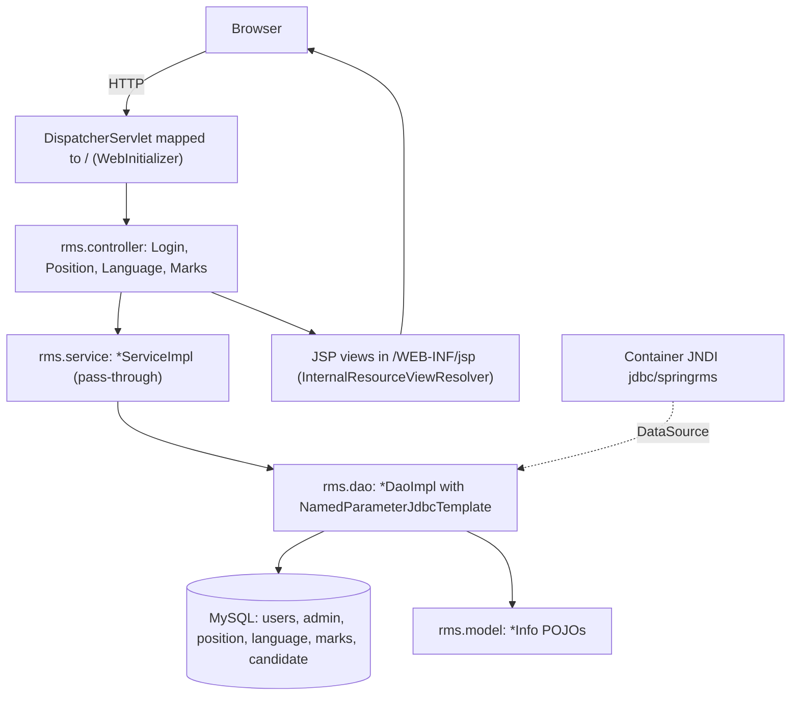

# Architecture

Purpose: How RMS is layered and how a request moves through it.
Last updated: 2026-09-26
Read this when: you need the overall picture before changing code, or you're deciding which layer a change belongs in.

## Overall diagram

Evidence: `src/main/java/rms/config/WebInitializer.java`, `rms/config/WebConfig.java`, and the `rms/controller`, `rms/service`, `rms/dao`, `rms/model` packages. There are no external integrations (`pom.xml`).

## Layers
| Layer | Package / location | Role | Evidence |
|---|---|---|---|
| Bootstrap | `rms.config.WebInitializer` | Registers the DispatcherServlet on `/` with `WebConfig` as the root config; there's no `main()` | `WebInitializer.java` |
| Config | `rms.config.WebConfig` | Sets up MVC, component scanning of `rms`, the DataSource and JdbcTemplate beans, the view resolver and static resources | `WebConfig.java` |
| Controller | `rms.controller` | `@Controller` classes returning `ModelAndView` | `rms/controller/*.java` |
| Service | `rms.service` | `@Service` classes that pass calls straight to the DAO, with no logic | `rms/service/*Impl.java` |
| DAO | `rms.dao` | `@Repository` classes with SQL as string fields and `RowMapper` inner classes | `rms/dao/*Impl.java` |
| Model | `rms.model` | Plain `*Info` POJOs | `rms/model/*.java` |
| View | `src/main/webapp/WEB-INF/jsp` | JSP pages with scriptlets and JSTL | `WEB-INF/jsp/*.jsp` |

## Request lifecycle
1. A `@Controller` method with `@RequestMapping(value, method)` receives the request (`rms/controller/*`).
2. It calls a `*ServiceImpl`, which passes the call to a `*DaoImpl` (`rms/service/*Impl.java`).
3. The DAO runs SQL through `NamedParameterJdbcTemplate` and maps rows to `*Info` models (`rms/dao/*Impl.java`).
4. The controller returns a `ModelAndView`, which resolves to `/WEB-INF/jsp/<view>.jsp`, or a `redirect:` after saves and deletes (`WebConfig.viewResolver`, `PositionController.save`).
5. **UI shell:** `main.jsp` is the page frame. Each menu item loads its page into `#container` inside an `<object>` element (`main.jsp`, the `load_*()` functions).

## Cross-cutting concerns
- **Transactions:** none. There's no `@Transactional` or transaction manager, although `spring-tx` is a dependency (`pom.xml`, `src/main/java`).
- **Error handling:** no `@ExceptionHandler` or `@ControllerAdvice`. Only `EmptyResultDataAccessException` is caught, in `LoginDaoImpl.checkUser` and `*DaoImpl.add*`. `findPositionById` and `findLanguageById` fail with an error when the key doesn't exist (`PositionDaoImpl`, `LanguageDaoImpl`).
- **Logging:** SLF4J with Logback, console only (`src/main/resources/logback.xml`; `rms` at INFO, `org.springframework` at WARN). The duplicate-name messages are `log.warn` (`PositionDaoImpl.java:73`, `LanguageDaoImpl.java:73`). One `System.out.println` remains: the not-logged-in fallback (`main.jsp:172`, G30).
- **Security:** nothing checks the session after login. There's no filter or interceptor, and no controller reads the `user` session attribute (`rms/controller/*`). The password is compared as plain text in SQL (`LoginDaoImpl`).
- **Validation:** none (no `@Valid` or `BindingResult`). The only checks are uppercase/trim and the duplicate-name check in `*DaoImpl.add*`.
- **Deletes:** sent as GET requests and remove the row (`*Controller.delete`, `*DaoImpl.delete*`).
