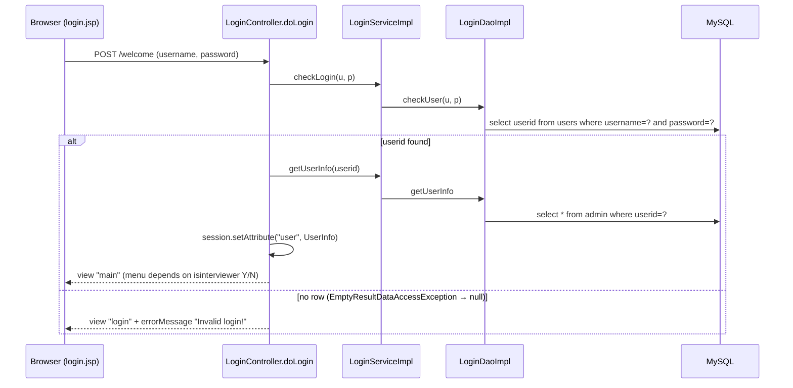
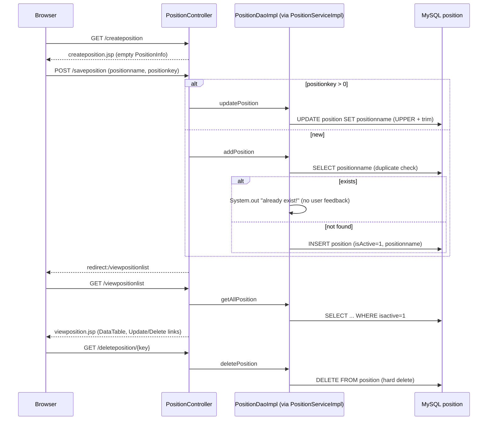
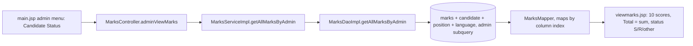

# RMS — Detailed Flow Traces

Detailed request traces that support the summary in [CLAUDE.md](../CLAUDE.md). Every step was confirmed by reading the source files named here.

## Flow 1: Login (`POST /welcome`)
Evidence: `src/main/java/rms/controller/LoginController.java`, `rms/service/LoginServiceImpl.java`, `rms/dao/LoginDaoImpl.java`, `src/main/webapp/WEB-INF/jsp/login.jsp`, `main.jsp`.

- `GET /login` invalidates the session and shows `login.jsp`. The Logout link in `main.jsp` points to `login`.
- `main.jsp` shows the admin menu when `isinterviewer` is `N` and the interviewer menu when it is `Y`.

## Flow 2: Position maintenance (Language is identical)
Evidence: `rms/controller/PositionController.java`, `rms/service/PositionServiceImpl.java`, `rms/dao/PositionDaoImpl.java`, `WEB-INF/jsp/createposition.jsp`, `viewposition.jsp`. For Language: `LanguageController`, `LanguageServiceImpl`, `LanguageDaoImpl`, table `language`.

## Flow 3: Candidate evaluation results (`GET /adminviewmarks`)
Evidence: `rms/controller/MarksController.java`, `rms/service/MarksServiceImpl.java`, `rms/dao/MarksDaoImpl.java` (`getAllMarksByAdmin`, `MarksMapper`), `WEB-INF/jsp/viewmarks.jsp`.

- The 10 criteria (`MarksInfo`) are work experience, technical knowledge, leadership, decision making, problem solving, stress tolerance, educational background, communication skill, attitude and personality.
- The total is the unweighted sum of the 10 scores (`viewmarks.jsp`, `getFullmarks`).
- The status column shows an image: `S` → `happy.jpg`, `R` → `sad.jpg`, anything else → `new.jpg` (`viewmarks.jsp`).
