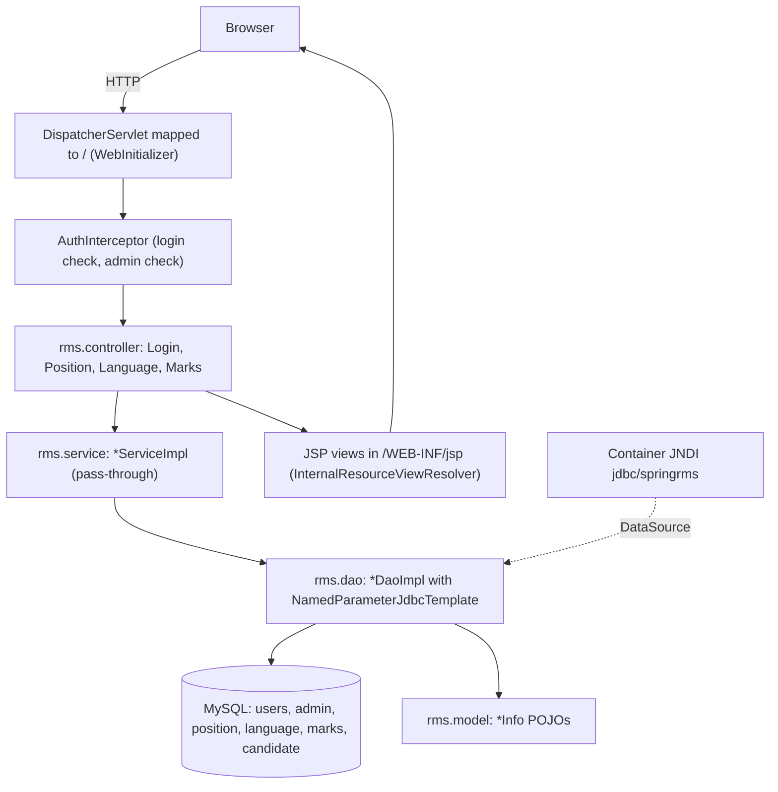

# Architecture

Purpose: How RMS is layered and how a request moves through it.
Last updated: 2026-10-01 (UI redesign: layout tag replaces the `<object>` menu frame). 2026-10-01 (small fixes batch: login redirects to `/home`, two interceptor registrations, 404 handling, soft delete, cookie-only sessions). 2026-09-30 (G11 login check; G27 output escaping)
Read this when: you need the overall picture before changing code, or you're deciding which layer a change belongs in.

## Overall diagram

```mermaid
flowchart TB
  U[Browser] -->|HTTP| DS["DispatcherServlet mapped to / (WebInitializer)"]
  DS --> AI["AuthInterceptor (login check, admin check)"]
  AI --> CTL["rms.controller: Login, Position, Language, Marks"]
  CTL --> SVC["rms.service: *ServiceImpl (pass-through)"]
  SVC --> DAO["rms.dao: *DaoImpl with NamedParameterJdbcTemplate"]
  DAO --> DB[("MySQL: users, admin, position, language, marks, candidate")]
  DAO --> M["rms.model: *Info POJOs"]
  CTL --> V["JSP views in /WEB-INF/jsp (InternalResourceViewResolver)"]
  V --> U
  JNDI["Container JNDI jdbc/springrms"] -.->|DataSource| DAO
```
Evidence: `src/main/java/rms/config/WebInitializer.java`, `rms/config/WebConfig.java`, `rms/config/AuthInterceptor.java`, and the `rms/controller`, `rms/service`, `rms/dao`, `rms/model` packages. There are no external integrations (`pom.xml`).

## Layers
| Layer | Package / location | Role | Evidence |
|---|---|---|---|
| Bootstrap | `rms.config.WebInitializer` | Registers the DispatcherServlet on `/` with `WebConfig` as the root config; there's no `main()` | `WebInitializer.java` |
| Config | `rms.config.WebConfig` | Sets up MVC, component scanning of `rms`, the DataSource and JdbcTemplate beans, the view resolver, static resources and the two interceptor registrations | `WebConfig.java` |
| Access check | `rms.config.AuthInterceptor` | Login check, and an admin check when constructed with `adminOnly` ([config.md](config.md)) | `AuthInterceptor.java` |
| Controller | `rms.controller` | `@Controller` classes returning `ModelAndView` | `rms/controller/*.java` |
| Service | `rms.service` | `@Service` classes that pass calls straight to the DAO, with no logic | `rms/service/*Impl.java` |
| DAO | `rms.dao` | `@Repository` classes with SQL as string fields and `RowMapper` inner classes | `rms/dao/*Impl.java` |
| Model | `rms.model` | Plain `*Info` POJOs | `rms/model/*.java` |
| View | `src/main/webapp/WEB-INF/jsp` | JSP pages with JSTL and EL (no scriptlets since 2026-10-01), sharing the `layout.tag` shell | `WEB-INF/jsp/*.jsp`, `WEB-INF/tags/layout.tag` |

## Request lifecycle
1. `AuthInterceptor` runs first on every DispatcherServlet request except `/login`, `/welcome` and `/resources/**` (`WebConfig.java:47-54`). Logged out → redirect to `/login`.
2. A `@Controller` method with `@RequestMapping(value, method)` receives the request (`rms/controller/*`).
3. It calls a `*ServiceImpl`, which passes the call to a `*DaoImpl` (`rms/service/*Impl.java`).
4. The DAO runs SQL through `NamedParameterJdbcTemplate` and maps rows to `*Info` models (`rms/dao/*Impl.java`).
5. The controller returns a `ModelAndView`, which resolves to `/WEB-INF/jsp/<view>.jsp`, or a `redirect:` after saves, deletes and the login (`WebConfig.viewResolver`, `PositionController.save`).
6. **Login:** `POST /welcome` with valid credentials answers 302 to `/home`, and `GET /home` renders `main.jsp` from the session, so a refresh doesn't re-post the credentials. `GET /` also redirects to `/home` (`LoginController.java:26-29,39-72`; flow in [business-flows/login.md](business-flows/login.md)).
7. **UI shell:** every page behind the login is a normal page wrapped in the `layout.tag` tag file, which renders the sidebar menu, the top bar and the content area (`WEB-INF/tags/layout.tag`). Menu items are plain links, so back, refresh and bookmarks work. `main.jsp` is the home page with quick links per role. Until the 2026-10-01 redesign, `main.jsp` was a frame that loaded each page into an `<object>` element.

## Cross-cutting concerns
- **Transactions:** none managed. There's no `@Transactional` or transaction manager, and none is needed: each write is a single statement (G19, closed as not a gap). `spring-tx` is declared on purpose, because the DAOs use its `DataAccessException` hierarchy (`pom.xml:72-76`).
- **Error handling:** no `@ExceptionHandler` or `@ControllerAdvice`.
  - The DAOs catch `EmptyResultDataAccessException` and return `null`: `LoginDaoImpl.checkUser` and `getUserInfo` (`LoginDaoImpl.java:55-57,66-68`), `PositionDaoImpl.findPositionById` (`:109-111`), `LanguageDaoImpl.findLanguageById` (`:92-94`).
  - A `null` from the finders becomes HTTP 404 through `ResponseStatusException` in the controllers (`PositionController.java:46-50,78-80`, `LanguageController.java:55-59,78-80`).
  - A business refusal (duplicate name, blank name) isn't an exception: the DAO returns `false` or the controller checks, and the create form is shown again with `errorMessage` (`PositionController.java:40-43,55-57`).
  - Any other exception, such as the database being down, still ends in HTTP 500.
- **Logging:** SLF4J with Logback, console only (`src/main/resources/logback.xml`; `rms` at INFO, `org.springframework` at WARN). There's no `System.out` left in `src` (`grep`, 2026-10-01). WARN lines: duplicate names (`PositionDaoImpl.java:65,82`, `LanguageDaoImpl.java:74,109`), a login refused for a missing `admin` row (`LoginController.java:49`, with the userid) and a refused admin page (`AuthInterceptor.java:44`, with the userid and servlet path).
- **Security:**
  - **Access control (G11):** `AuthInterceptor` is registered twice in `WebConfig.addInterceptors`. Login-only covers `/` and `/home`; admin-only covers every other path except `/login`, `/welcome` and `/resources/**`. No `user` session attribute → redirect to `/login`; admin-only and `isinterviewer` not `N` (including NULL) → HTTP 403. New interviewer pages (G5) must go into the login-only registration. The controllers themselves still don't read the session for access decisions. Evidence: `WebConfig.java:47-54`, `AuthInterceptor.java:36-50`.
  - **Caching:** pages behind the login send `Cache-Control: no-store` (`AuthInterceptor.java:50`).
  - **Session:** the session id changes at login (`LoginController.java:54`, against session fixation). Sessions are tracked by cookie only (no `;jsessionid` in URLs, G41), and the cookie is `SameSite=Lax` (`web.xml:15-23`). `UserInfo` is `Serializable` (G36).
  - **Output:** the JSPs print user and database text through `<c:out>` (G27).
  - **Open:** no CSRF token (G32; deletes are POST-only, logout is still a GET), and the password is compared as plain text in SQL (`LoginDaoImpl`, G13).
- **Validation:** no `@Valid` or `BindingResult`. The controllers refuse a blank or missing name (`PositionController.java:40-43`, `LanguageController.java:49-52`); the DAOs upper-case and trim names and refuse duplicates among active rows. There's no length check (G28).
- **Deletes:** POST only. They set `isactive=0` instead of removing the row, and adding the same name again reactivates the oldest deleted row (rules in [data-model.md](data-model.md); flow in [business-flows/masters.md](business-flows/masters.md)).
