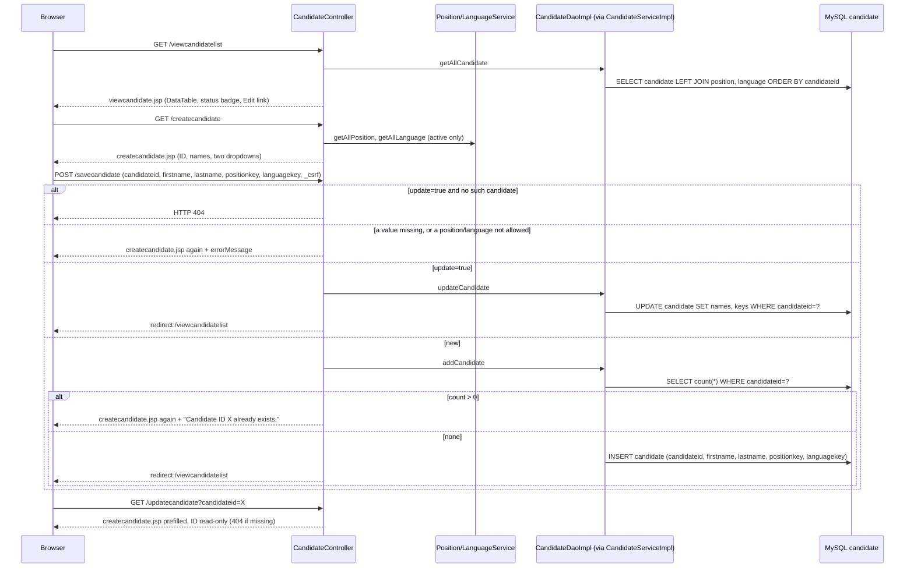

# Flow: Candidate Management

Purpose: Traces adding, listing and editing candidates (G1).
Last updated: 2026-10-02 (first version: add, list and edit; no delete)
Read this when: you're fixing or extending candidate management, or building a module that picks a candidate (score entry G5, schedules G3).

Evidence: `rms/controller/CandidateController.java`, `rms/service/CandidateServiceImpl.java`, `rms/dao/CandidateDaoImpl.java`, `rms/model/CandidateInfo.java`, `WEB-INF/jsp/createcandidate.jsp`, `viewcandidate.jsp`, `WEB-INF/tags/layout.tag:71-74` (menu), `main.jsp` (home tile). Tests: `rms/controller/CandidateControllerTest`, `rms/dao/CandidateDaoImplTest` (needs Docker), `rms/config/SecurityConfigTest` (access and CSRF), `rms/SmokeTest.candidatePagesRender`.

## Endpoints
| Action | URL | Handler |
|---|---|---|
| List | `GET /viewcandidatelist` | `viewCandidate()` → `viewcandidate.jsp` |
| New form | `GET /createcandidate` | `createCandidate()` → `createcandidate.jsp` |
| Save (add or edit) | `POST /savecandidate` (the edit form adds `update=true`) | `save()` → redirect to the list, or the form again with `errorMessage` |
| Edit form | `GET /updatecandidate?candidateid=…` | `update()` → `createcandidate.jsp` prefilled; 404 if missing |

`CandidateController.java:40-92`. There's no delete (open question #26).

## Notes
- **Access:** admin only. No rule in `SecurityConfig` names these paths, so `anyRequest().hasRole("ADMIN")` covers them; an interviewer gets 403 and a logged-out user goes to `/login` (`SecurityConfigTest.interviewerIsRefusedAdminPages`, `loggedOutRequestsRedirectToLogin`). Saves need the CSRF token, which `form:form` adds (`postWithoutCsrfTokenIsRefused`).
- **Candidate ID:** the admin types it on Add; the form says it must be unique. It's trimmed, kept as typed (not upper-cased), and read-only on Edit. The DAO counts rows with that ID before the insert, and the count and insert are `synchronized` (one Tomcat only), because whether `candidateid` is a primary key in production is unknown (`CandidateDaoImpl.java:30,62-80`; G22). An insert that still hits a duplicate key (another node, or another writer) is refused the same way. The WARN doesn't name the ID, which may be personal data. How production makes IDs is open question #26.
- **IDs in URLs:** the Edit link passes the ID as a query parameter built with `c:url` and `c:param` (`viewcandidate.jsp`), not as a path segment, because IDs are free text and Spring Security's firewall refuses some characters in paths, such as `;` and an encoded `/`. `c:param` encodes `+` as `%2B`; `spring:param` would leave it, and the server would read it as a space (found in review).
- **Validation** (`CandidateController.check`, `:95-117`), first failure wins, the form keeps the typed values:
  - Add without an ID: "Please enter a candidate ID."
  - Blank or missing first or last name: "Please enter the first name." / "Please enter the last name." Both are required because the Candidate Status query builds the name with `concat(firstname,' ',lastname)`, which is NULL if either is NULL (`MarksDaoImpl.java:19-21`).
  - Position or language not chosen (key 0), deleted or unknown: "Please choose a position." / "Please choose a language."
  - No length check, because the column lengths are unknown (G22), as for positions (G28).
- **Deleted position or language:** the dropdowns list active rows only. When editing a candidate whose position or language was deleted since, that one is offered too, labelled "NAME (deleted)", and keeping it is allowed; moving a candidate to a deleted one isn't (`CandidateController.form`, `:123-153`). Without this, opening and saving the form would silently change the candidate.
- **List:** every candidate, sorted by ID, with the position and language names through left joins, so a candidate still shows when its position or language is deleted (soft delete keeps the name) or missing (empty cell) (`CandidateDaoImpl.java:24-28`). The status badge reads `candidatestatus` like Candidate Status: S Selected, R Rejected, anything else, including NULL, Pending.
- **Status:** never written. A new candidate has `candidatestatus` NULL, and Edit doesn't change it (G9, #2).
- **Edit form posted for a missing candidate:** 404, as for positions (`:56-61`).
- **Escaping:** IDs and names print through `<c:out>`; the `form:` tags escape by default (G27).
- **Known gaps:** G1 (partly done: no delete, ID assignment open, #26), G9 (status), G22 (inferred schema; the DAO tests run against `db/schema.sql`).
