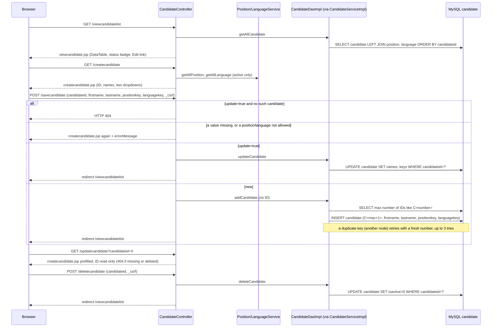

# Flow: Candidate Management

Purpose: Traces adding, listing, editing and deleting candidates (G1).
Last updated: 2026-10-02 (soft delete by owner decision; needs `db/migrations/001-candidate-isactive.sql`). 2026-10-02 (generated IDs C1, C2, ... by owner decision; list sorted by number). 2026-10-02 (first version: add, list and edit; no delete)
Read this when: you're fixing or extending candidate management, or building a module that picks a candidate (score entry G5, schedules G3).

Evidence: `rms/controller/CandidateController.java`, `rms/service/CandidateServiceImpl.java`, `rms/dao/CandidateDaoImpl.java`, `rms/model/CandidateInfo.java`, `WEB-INF/jsp/createcandidate.jsp`, `viewcandidate.jsp`, `WEB-INF/tags/layout.tag:71-74` (menu), `main.jsp` (home tile). Tests: `rms/controller/CandidateControllerTest`, `rms/dao/CandidateDaoImplTest` (needs Docker), `rms/config/SecurityConfigTest` (access and CSRF), `rms/SmokeTest.candidatePagesRender`.

## Endpoints
| Action | URL | Handler |
|---|---|---|
| List | `GET /viewcandidatelist` | `viewCandidate()` → `viewcandidate.jsp` |
| New form | `GET /createcandidate` | `createCandidate()` → `createcandidate.jsp` |
| Save (add or edit) | `POST /savecandidate` (the edit form adds `update=true`) | `save()` → redirect to the list, or the form again with `errorMessage` |
| Edit form | `GET /updatecandidate?candidateid=…` | `update()` → `createcandidate.jsp` prefilled; 404 if missing or deleted |
| Delete (soft) | `POST /deletecandidate` with the form field `candidateid` | `delete()` → redirect to the list; a GET gets 405 |

`CandidateController.java:40-102`.

## Notes
- **Access:** admin only. No rule in `SecurityConfig` names these paths, so `anyRequest().hasRole("ADMIN")` covers them; an interviewer gets 403 and a logged-out user goes to `/login` (`SecurityConfigTest.interviewerIsRefusedAdminPages`, `loggedOutRequestsRedirectToLogin`). Saves need the CSRF token, which `form:form` adds (`postWithoutCsrfTokenIsRefused`).
- **Candidate ID:** RMS generates it (owner decision 2026-10-02): `C` plus the next number after the highest existing ID of the form `C<number>` (up to 9 digits), so the seed's C1 and C2 are followed by C3. IDs in other formats, from before the generator, are left alone and don't count (`CandidateDaoImpl.lastnumber`, `addCandidate`, `:31-34,68-90`). The Add form has no ID field, and an ID posted with a new candidate is ignored; Edit shows the ID read-only. Reading the number and inserting are `synchronized` (one Tomcat only). If the insert hits a duplicate key anyway (another node, or another writer; only when `candidateid` is a key, which is unknown, G22), it retries with a fresh number, up to 3 times. Without a key in production, two nodes could still create the same ID.
- **Order:** the list sorts shorter IDs first, then by text, so C2 comes before C10 (`allcandidate`); the table's ID column sorts by that server order (`data-order` in `viewcandidate.jsp`), not as text.
- **IDs in URLs:** the Edit link passes the ID as a query parameter built with `c:url` and `c:param` (`viewcandidate.jsp`), not as a path segment, because IDs from before the generator may be any text and Spring Security's firewall refuses some characters in paths, such as `;` and an encoded `/`. `c:param` encodes `+` as `%2B`; `spring:param` would leave it, and the server would read it as a space (found in review).
- **Validation** (`CandidateController.check`, `:105-124`), first failure wins, the form keeps the typed values:
  - Blank or missing first or last name: "Please enter the first name." / "Please enter the last name." Both are required because the Candidate Status query builds the name with `concat(firstname,' ',lastname)`, which is NULL if either is NULL (`MarksDaoImpl.java:19-21`).
  - Position or language not chosen (key 0), deleted or unknown: "Please choose a position." / "Please choose a language."
  - No length check, because the column lengths are unknown (G22), as for positions (G28).
- **Deleted position or language:** the dropdowns list active rows only. When editing a candidate whose position or language was deleted since, that one is offered too, labelled "NAME (deleted)", and keeping it is allowed; moving a candidate to a deleted one isn't (`CandidateController.form`, `:130-160`). Without this, opening and saving the form would silently change the candidate.
- **List:** every candidate, sorted by ID (see Order), with the position and language names through left joins, so a candidate still shows when its position or language is deleted (soft delete keeps the name) or missing (empty cell) (`CandidateDaoImpl.java:24-29`). The status badge reads `candidatestatus` like Candidate Status: S Selected, R Rejected, anything else, including NULL, Pending.
- **Soft delete** (owner decision 2026-10-02, like positions, open question #5): Delete is a small POST form with a confirmation prompt; the ID goes in a hidden field, not the URL (`viewcandidate.jsp`). It sets `candidate.isactive = 0` and keeps the row (`deletecandidate`). A deleted candidate:
  - leaves the Candidates list, and its Edit form and saves give 404 (the list, `findCandidateById` and the update all filter on `isactive=1`);
  - **still shows on Candidate Status with its scores**, because that query doesn't filter on `candidate.isactive`, the same as for deleted positions and languages (`MarksDaoImplTest.deletedCandidateStillShowsWithTheirScores`). Hiding them there is a one-line change if the owner wants it (open question #26);
  - keeps its ID: the generator counts deleted rows too, so the ID is never reused (`CandidateDaoImplTest.deletedIdsAreNotReused`). There's no undelete.
  - Deleting a missing or already deleted ID changes nothing and still redirects, as for positions.
- **Database change:** `candidate.isactive` is a new column (`TINYINT NOT NULL DEFAULT 1`). `db/schema.sql` has it, so the DAO tests and a fresh `db/local` database do. Production, and any local database made before 2026-10-02, needs `db/migrations/001-candidate-isactive.sql` before this WAR is deployed; without it the Candidates pages fail with an unknown-column error (other pages are unaffected).
- **Status:** never written. A new candidate has `candidatestatus` NULL, and Edit doesn't change it (G9, #2).
- **Edit form posted for a missing candidate:** 404, as for positions (`:56-61`).
- **Escaping:** IDs and names print through `<c:out>`; the `form:` tags escape by default (G27).
- **Known gaps:** G1 (fixed 2026-10-02; migration 001 still to run in production), G9 (status), G22 (inferred schema; the DAO tests run against `db/schema.sql`).
