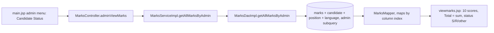

# Flow: Candidate Evaluation Results

Purpose: Traces the admin's read-only view of candidate scores and status.
Last updated: 2026-09-25
Read this when: you're working on scores, candidate status, the results page, or the unfinished interviewer score entry.

Evidence: `rms/controller/MarksController.java`, `rms/service/MarksServiceImpl.java`, `rms/dao/MarksDaoImpl.java` (`getAllMarksByAdmin`, `MarksMapper`), `WEB-INF/jsp/viewmarks.jsp`, `main.jsp`.

## Business rules in code
- **The 10 criteria** (`MarksInfo`, `viewmarks.jsp` headers): work experience, technical knowledge, leadership, decision making, problem solving, stress tolerance, educational background, communication skill, attitude, personality.
- **Total:** the unweighted sum of the 10 scores (`viewmarks.jsp`, `getFullmarks`).
- **Status image:** `S` → `happy.jpg`, `R` → `sad.jpg`, anything else → `new.jpg` (`viewmarks.jsp`).
- **Query:** joins `marks` → `candidate` → `position` and `language`, with subqueries for the interviewer and candidate names, ordered by `candidateid` (`MarksDaoImpl.getallmarksbyadmin`).

## Not implemented (partial)
- **Interviewer score entry:** `MarksDaoImpl.saveMarks` is empty, `getAllMarksByInterviewer` returns `null`, and `getFullmarks` returns 0.
- **Menu link:** the interviewer menu calls `MarksController?user=…`, which no mapping matches (`main.jsp`).

Known gaps: G5–G7 (score entry), G8 (dead `getFullmarks`), G9 (status never written) and G10 (column mapping), in [gaps.md](../gaps.md).
