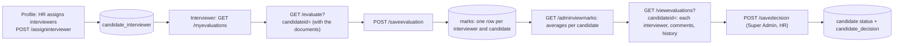

# Flow: Assignment, Evaluation and Decision

Purpose: Traces assigning interviewers, interviewers' evaluations, the Candidate Status averages, and the Selected / Rejected / On hold decision.
Last updated: 2026-10-03 (the dashboard flag for an inactive interviewer is built in Phase 4). 2026-10-02 (Phase 3 of the roles plan: rewritten; G5, G6, G7, G9, G10 fixed; migration 005, a draft). 2026-10-01 (Spring Security 7 replaces AuthInterceptor). 2026-10-01 (UI redesign). 2026-10-01 (`getFullmarks` removed, G8; null-safe status, G16). 2026-09-30 (names escaped, G27; G38)
Read this when: you're working on scores, assignments, Candidate Status, decisions or interviewer pages.

Evidence: `rms/controller/EvaluationController.java`, `AssignmentController.java`, `MarksController.java`, `CandidateController.profile`, `DocumentController.download`, `CurrentUser.java`; `rms/service/MarksServiceImpl.java`, `AssignmentServiceImpl.java`, `DecisionServiceImpl.java`; `rms/dao/MarksDaoImpl.java`, `AssignmentDaoImpl.java`, `DecisionDaoImpl.java`; `rms/model/MarksInfo.java`, `ResultInfo.java`, `AssignmentInfo.java`, `DecisionInfo.java`, `DecisionStatus.java`, `Criterion.java`; `WEB-INF/jsp/viewmarks.jsp`, `viewevaluations.jsp`, `evaluate.jsp`, `myevaluations.jsp`, `candidateprofile.jsp` (Interviewers card), `WEB-INF/tags/status.tag`. Tests: `EvaluationControllerTest`, `AssignmentControllerTest`, `MarksControllerTest`, `EvaluationServicesTest`, `EvaluationModelTest`, `SecurityConfigTest`, and `MarksDaoImplTest`, `AssignmentDaoImplTest`, `DecisionDaoImplTest` (need Docker; not run yet).

```mermaid
flowchart LR
  P["Profile: HR assigns interviewers<br/>POST /assigninterviewer"] --> A[("candidate_interviewer")]
  A --> M["Interviewer: GET /myevaluations"]
  M --> E["GET /evaluate?candidateid= (with the documents)"]
  E --> S["POST /saveevaluation"]
  S --> K[("marks: one row per interviewer and candidate")]
  K --> C["GET /adminviewmarks: averages per candidate"]
  C --> V["GET /viewevaluations?candidateid=: each interviewer, comments, history"]
  V --> D["POST /savedecision (Super Admin, HR)"]
  D --> X[("candidate status + candidate_decision")]
```

## Endpoints and access (`SecurityConfig`)
| Action | URL | Who |
|---|---|---|
| Candidate Status (averages) | `GET /adminviewmarks` | Super Admin, HR, Hiring Manager |
| A candidate's evaluations and decisions | `GET /viewevaluations?candidateid=` | Super Admin, HR, Hiring Manager (read-only) |
| Record a decision | `POST /savedecision` | Super Admin, HR |
| Assign / unassign an interviewer | `POST /assigninterviewer`, `POST /unassigninterviewer` (on the profile) | Super Admin, HR |
| My Evaluations | `GET /myevaluations` | Interviewer |
| Evaluation form | `GET /evaluate?candidateid=`, `POST /saveevaluation` | Interviewer, for candidates assigned to them (403 otherwise; read-only once unassigned) |
| Profile and documents | `GET /viewcandidate`, `GET /downloaddocument/{key}` | staff, and interviewers for their assigned candidates (checked in `CandidateController`, `DocumentController`; 403 otherwise) |

Staff can't evaluate, and interviewers can't open Candidate Status, other interviewers' scores or the decision.

## Assignment
- On the profile, Super Admin and HR see the **Interviewers** card: each assigned interviewer, when, and whether their evaluation is in; Assign (a list of active Interviewer-role users not assigned yet, decision F) and Unassign (confirm prompt). Hiring Managers see the list only.
- **Deactivated interviewer** (addition 1): the assignment stays and shows "interviewer inactive" (also when the user's role is no longer Interviewer), so HR can reassign. Reactivating the user restores everything. The dashboard shows how many candidates have such an assignment ([schedule.md](schedule.md)).
- **Unassigning** keeps the row (`isactive = 0`, `unassignedby`, `unassignedat`) and the interviewer's evaluation, which still counts; the interviewer can see it on My Evaluations ("No longer assigned") but not change it. Without an assignment the evaluation form no longer lists the candidate's documents.
- The check and the insert are `synchronized` in `AssignmentDaoImpl.assign` (one Tomcat); on two nodes a double click could add the assignment twice, which shows twice and is ended by one Unassign.

## Evaluation (G5, G6)
- **My Evaluations** (G7): the interviewer's assigned candidates, plus candidates they evaluated and were unassigned from; "To do" or "Submitted", the status, and Evaluate / Edit / View.
- **Form** (`evaluate.jsp`): the 10 criteria (`Criterion`), each scored 1 to 10 (a "-" choice means not scored), an optional comment per criterion (at most 255 characters) and an optional overall comment (at most 1000). The candidate's documents are listed beside it as downloads.
- **Rules** (`MarksServiceImpl.saveEvaluation`): every score 1 to 10 ("Please score every criterion from 1 to 10."), comments trimmed, blank ones stored as NULL. The interviewer is the session user; a posted `interviewerid` or `markkey` is ignored (`@InitBinder`).
- **One evaluation per interviewer and candidate:** saving updates their existing one (the oldest, if older data has several) or inserts one (`MarksDaoImpl.saveMarks`). It runs in a transaction that locks the candidate's row (`SELECT … FOR UPDATE`) and re-checks, under the lock, that the candidate is active and not Selected or Rejected and that the interviewer is still assigned (`LOCK IN SHARE MODE` on the assignment, so an unassignment committing meanwhile waits); otherwise "This evaluation can't be saved any more…".
- **Locked** when the decision is Selected or Rejected (decision I): the form shows the evaluation read-only. On hold doesn't lock. A decision changed back to On hold unlocks.
- **Older rows** (decision E): rows from before Phase 3 keep their scores, whatever the scale, and count in the averages; only new or changed evaluations must be 1 to 10. They have no dates or comments. They also have no assignment, so they show as "unassigned" and their authors can't edit them, unless the owner runs the optional backfill in migration 005 (open question #29).

## Candidate Status (G10)
- One row per **active** candidate (deleted ones are hidden, decision N), with or without evaluations: the number of evaluations, the **average** of each criterion over the active evaluations (`marks.isactive = 1`), and the total of the averages (at most 100), each to one decimal. "-" without evaluations. The total is the sum of the unrounded averages (`ResultInfo.getTotal`).
- The name opens `/viewevaluations`: each interviewer's 10 scores and total, "interviewer inactive" or "unassigned" flags, when it was saved, the per-criterion and overall comments, the average row, and the decision history.
- **G10 fixed:** `marks` is read by column name (`MarksDaoImpl`), no longer by position, and the interviewer and candidate names have their own fields.

## Decision (G9)
- On `/viewevaluations`, Super Admin and HR choose **Selected, Rejected or On hold**, a **reason** (required, at most 500 characters) and a **date** (today by default, not in the future). Decided-by is the session user. Never automatic.
- Allowed without evaluations; the page warns, and the message adds "Note: there are no evaluations yet."
- `DecisionDaoImpl.saveDecision`: in one transaction, `candidate.candidatestatus`, `decisionreason`, `decisiondate`, `decidedby`, and a new `candidate_decision` row (`decidedat = now()`). Every change is logged, also the same decision again.
- The status shows everywhere through `status.tag`: S Selected (green), R Rejected (red), H On hold (yellow), anything else Pending. `S`/`R` stay compatible with older rows and older WARs (which show H as Pending).
- The profile shows the latest reason, date and decider to staff.

## Logging
Keys only: "Evaluation {markkey} of candidate {id} saved by {userid}", "Interviewer {userid} assigned to candidate {id} by {userid}", "Decision on candidate {id} saved by {userid}", and refused profile or download attempts by interviewers. No scores, comments, statuses or reasons.

## Database (migration 005, a draft)
New columns at the **end** of `marks` (`markkey`, `comments`, 10 per-criterion comments, `createdat`, `updatedat`), three on `candidate`, and the tables `candidate_interviewer` and `candidate_decision`. The script must be checked against `SHOW CREATE TABLE marks` before it runs (decision D; open question #29). Older WARs read `marks` by position, so after 005 they show every status as Pending; roll back with the script's lines first.

Known gaps: G5, G6, G7, G9, G10 fixed 2026-10-02 (not yet DB-verified); G22 (inferred schema). Interviewer workload and schedules come in Phase 4 (G3).
