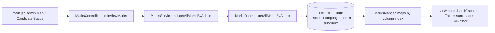

# Flow: Candidate Evaluation Results

Purpose: Traces the admin's read-only view of candidate scores and status.
Last updated: 2026-10-01 (`getFullmarks` removed, G8; deleted positions and languages still show, G17; null-safe status, G16). 2026-09-30 (names escaped, G27; no userid in the score-entry URL, G38)
Read this when: you're working on scores, candidate status, the results page, or the unfinished interviewer score entry.

Evidence: `rms/controller/MarksController.java`, `rms/service/MarksServiceImpl.java`, `rms/dao/MarksDaoImpl.java` (`getAllMarksByAdmin`, `MarksMapper`), `WEB-INF/jsp/viewmarks.jsp`, `main.jsp`.

```mermaid
flowchart LR
  A["main.jsp admin menu: Candidate Status"] --> B[MarksController.adminViewMarks]
  B --> C[MarksServiceImpl.getAllMarksByAdmin]
  C --> D[MarksDaoImpl.getAllMarksByAdmin]
  D --> E[("marks + candidate + position + language, admin subquery")]
  E --> F["MarksMapper, maps by column index"]
  F --> G["viewmarks.jsp: 10 scores, Total = sum, status S/R/other"]
```

## Business rules in code
- **The 10 criteria** (`MarksInfo`, `viewmarks.jsp` headers): work experience, technical knowledge, leadership, decision making, problem solving, stress tolerance, educational background, communication skill, attitude, personality.
- **Total:** the unweighted sum of the 10 scores, computed in the JSP by its own `getFullmarks` method (`viewmarks.jsp:35-44,94`). The DAO has no such method any more (G8).
- **Status image:** `S` → `happy.jpg`, `R` → `sad.jpg`, anything else, including NULL → `new.jpg` (`viewmarks.jsp:96-102`; the comparisons are null-safe, G16).
- **Query:** joins `marks` → `candidate` → `position` and `language`, with subqueries for the interviewer and candidate names, ordered by `candidateid` (`MarksDaoImpl.getallmarksbyadmin`, `MarksDaoImpl.java:19-25`).
- **Deleted masters still show:** the query is an inner join with no `isactive` filter on `position` or `language`, and positions and languages are soft-deleted (G17). A candidate whose position or language was deleted keeps its row, with the deleted name. A hard delete would have dropped it. Pinned by `MarksDaoImplTest.deletedPositionAndLanguageStillShowWithTheirCandidates` (`:55`).

## Not implemented (partial)
- **Interviewer score entry:** `MarksDaoImpl.saveMarks` is empty and `getAllMarksByInterviewer` returns `null` (`MarksDaoImpl.java:62-65,68-71`). The dead `getFullmarks` that returned 0 was removed (G8).
- **Menu link:** the interviewer menu calls `MarksController` and `MarksController?param=VIEW`, which no mapping matches (`main.jsp`). Until 2026-09-30 it also passed the userid as `?user=…` (G38). Score entry (G5) must take the interviewer from the session, not from a parameter.
- **Output:** candidate, position and language names are escaped with `<c:out>` (`viewmarks.jsp`, G27). A candidate with a NULL first or last name shows a blank name, because `concat` returns NULL; until 2026-09-30 it showed "null".

Known gaps: G5–G7 (score entry; interviewer pages must also join the login-only interceptor registration, G11), G9 (status never written) and G10 (column mapping), in [gaps.md](../gaps.md). G8 (dead `getFullmarks`) and G16 (NULL status) are fixed.
