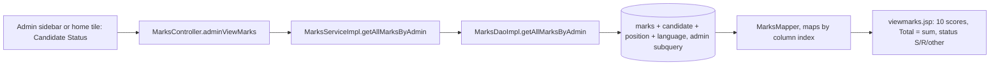

# Flow: Candidate Evaluation Results

Purpose: Traces the admin's read-only view of candidate scores and status.
Last updated: 2026-10-01 (Spring Security 7 replaces AuthInterceptor). 2026-10-01 (UI redesign: status badges, EL total, "Coming soon" menu entries). 2026-10-01 (`getFullmarks` removed, G8; deleted positions and languages still show, G17; null-safe status, G16). 2026-09-30 (names escaped, G27; no userid in the score-entry URL, G38)
Read this when: you're working on scores, candidate status, the results page, or the unfinished interviewer score entry.

Evidence: `rms/controller/MarksController.java`, `rms/service/MarksServiceImpl.java`, `rms/dao/MarksDaoImpl.java` (`getAllMarksByAdmin`, `MarksMapper`), `WEB-INF/jsp/viewmarks.jsp`, `WEB-INF/tags/layout.tag` (menu), `main.jsp` (home tile).

```mermaid
flowchart LR
  A["Admin sidebar or home tile: Candidate Status"] --> B[MarksController.adminViewMarks]
  B --> C[MarksServiceImpl.getAllMarksByAdmin]
  C --> D[MarksDaoImpl.getAllMarksByAdmin]
  D --> E[("marks + candidate + position + language, admin subquery")]
  E --> F["MarksMapper, maps by column index"]
  F --> G["viewmarks.jsp: 10 scores, Total = sum, status S/R/other"]
```

## Business rules in code
- **The 10 criteria** (`MarksInfo`, `viewmarks.jsp` headers): work experience, technical knowledge, leadership, decision making, problem solving, stress tolerance, educational background, communication skill, attitude, personality.
- **Total:** the unweighted sum of the 10 scores, computed in EL in the JSP (`viewmarks.jsp:55`). The DAO has no such method any more (G8). Until the 2026-10-01 redesign the JSP had its own `getFullmarks` scriptlet method.
- **Status badge:** `S` → green "Selected", `R` → red "Rejected", anything else, including NULL → grey "Pending" (`viewmarks.jsp:57-67`; `fn:toUpperCase` makes the check case-insensitive and null-safe, G16). Until the 2026-10-01 redesign these were the images `happy.jpg`, `sad.jpg` and `new.jpg`.
- **Query:** joins `marks` → `candidate` → `position` and `language`, with subqueries for the interviewer and candidate names, ordered by `candidateid` (`MarksDaoImpl.getallmarksbyadmin`, `MarksDaoImpl.java:19-25`).
- **Deleted masters still show:** the query is an inner join with no `isactive` filter on `position` or `language`, and positions and languages are soft-deleted (G17). A candidate whose position or language was deleted keeps its row, with the deleted name. A hard delete would have dropped it. Pinned by `MarksDaoImplTest.deletedPositionAndLanguageStillShowWithTheirCandidates` (`:55`).

## Not implemented (partial)
- **Interviewer score entry:** `MarksDaoImpl.saveMarks` is empty and `getAllMarksByInterviewer` returns `null` (`MarksDaoImpl.java:62-65,68-71`). The dead `getFullmarks` that returned 0 was removed (G8).
- **Menu entries:** the interviewer menu shows "Evaluation" and "Show Evaluation" as disabled "Coming soon" entries with no URL (`layout.tag:91-97`), and the interviewer home page says evaluations are coming (`main.jsp:65-79`). Until the 2026-10-01 redesign they called `MarksController` and `MarksController?param=VIEW`, which no mapping matched, and until 2026-09-30 they also passed the userid as `?user=…` (G38). Score entry (G5) must take the interviewer from the session, not from a parameter.
- **Output:** candidate, position and language names are escaped with `<c:out>` (`viewmarks.jsp`, G27). A candidate with a NULL first or last name shows a blank name, because `concat` returns NULL; until 2026-09-30 it showed "null".

Known gaps: G5–G7 (score entry; interviewer pages also need their own rule in `SecurityConfig`, G11), G9 (status never written) and G10 (column mapping), in [gaps.md](../gaps.md). G8 (dead `getFullmarks`) and G16 (NULL status) are fixed.
