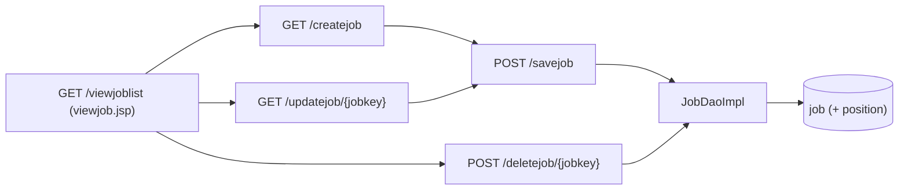

# Flow: Jobs

Purpose: Traces the Jobs module (G4): openings built on a position, and linking a candidate to one.
Last updated: 2026-10-02 (Phase 2 of the roles plan: first version; migration 004)
Read this when: you're changing jobs or the candidate's job link.

Evidence: `rms/controller/JobController.java`, `rms/service/JobServiceImpl.java`, `rms/dao/JobDaoImpl.java`, `rms/model/JobInfo.java`, `WEB-INF/jsp/viewjob.jsp`, `createjob.jsp`, `layout.tag` (Recruitment › Jobs), `main.jsp` (tile); the link: `CandidateController.checkJob`, `createcandidate.jsp`. Tests: `JobControllerTest`, `CandidateControllerTest` (job cases), `JobDaoImplTest` (needs Docker), `SecurityConfigTest`, `SmokeTest.jobAndProfilePagesRender`.

## Endpoints
| Action | URL | Who |
|---|---|---|
| List | `GET /viewjoblist` | Super Admin, HR, Hiring Manager (read-only: no Add, Edit or Delete) |
| Add / edit form | `GET /createjob`, `GET /updatejob/{jobkey}` (404 for a missing or deleted job) | Super Admin, HR |
| Save | `POST /savejob` (`jobkey` 0 adds) | Super Admin, HR |
| Delete (soft) | `POST /deletejob/{jobkey}` | Super Admin, HR |

## Rules
- **Fields:** position (an active one, or the one the job already has), vacancies (1 to 999), closing date (optional), status `OPEN` or `CLOSED`. Only these bind (`@InitBinder`).
- **Status is set by HR.** Nothing closes a job automatically, not even a past closing date.
- **List:** active jobs, open and closed, by key, with the position name through a left join (a deleted position still shows).
- **Delete** is soft (`job.isactive = 0`). Candidates linked to it keep `candidate.jobkey`; their profile shows "Job n (deleted)".

## A candidate's job (decision M)
- The candidate form has an optional **Job** list of the active open jobs ("Job 1: SOFTWARE ENGINEER (closes 2030-12-31)").
- With a job, the server sets the candidate's position to the **job's position**, whatever was chosen (`CandidateController.checkJob`). No position needs choosing then.
- A new link must be to an open job ("That job is closed. Please choose an open job, or none."). A candidate who already has a job keeps it when the job is later closed or deleted; the form offers it as "(closed)" or "(deleted)". A deleted job keeps the candidate's current position.

Known gaps: G4 (fixed 2026-10-02 in Phase 2; migration 004 still to run in production), G22.
