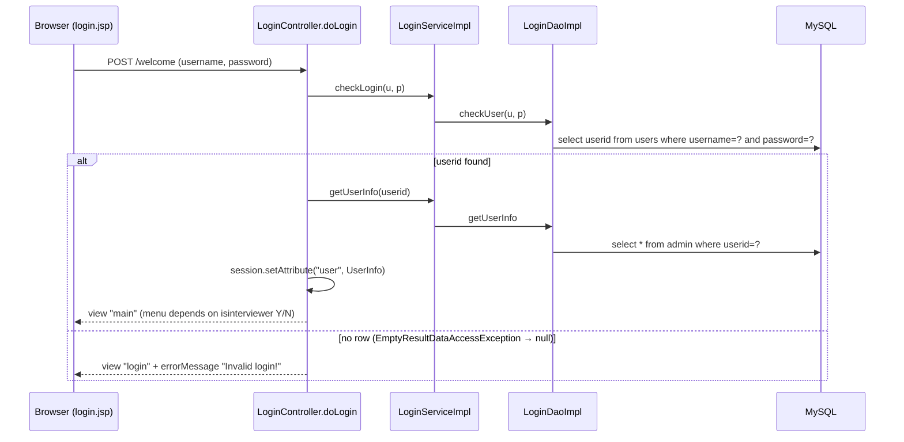

# Flow: Login / Session

Purpose: Traces the login, role-based menu and logout.
Last updated: 2026-09-25
Read this when: you're fixing login or logout, the role-based menu, or session handling.

Evidence: `rms/controller/LoginController.java`, `rms/service/LoginServiceImpl.java`, `rms/dao/LoginDaoImpl.java`, `WEB-INF/jsp/login.jsp`, `main.jsp`.

## Notes
- **Login page and logout:** `GET /login` invalidates the session and shows `login.jsp`. The Logout link in `main.jsp` points to `login` (`LoginController.loginPage`).
- **Role-based menu:** `main.jsp` shows the admin menu when `isinterviewer` is `N` and the interviewer menu when it is `Y`, and displays the name, role and email (`main.jsp`).
- **Password check:** the password is compared as plain text in SQL (`LoginDaoImpl.listallusers`).
- **Session use:** the `user` session attribute is set but never checked by other controllers (`rms/controller/*`).
- **Shared field:** `LoginController` keeps `userinfo` in an instance field, which is shared across requests because the controller is a singleton (`LoginController.java`).
- **Known gaps** (details in [gaps.md](../gaps.md)):
  - G11: no auth checks.
  - G12: shared field.
  - G13: plain-text password.
  - G26: HTTP 500 if a user has no `admin` row.
  - G27: unescaped profile output in `main.jsp`.
  - G30: the menu is only reached via POST; the fallback redirect ignores the app's context path; the session isn't renewed at login.
