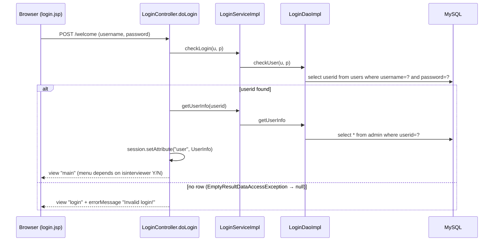

# Flow: Login / Session

Purpose: Traces the login, role-based menu and logout.
Last updated: 2026-09-30 (G11 login check)
Read this when: you're fixing login or logout, the role-based menu, or session handling.

Evidence: `rms/controller/LoginController.java`, `rms/config/AuthInterceptor.java`, `rms/service/LoginServiceImpl.java`, `rms/dao/LoginDaoImpl.java`, `WEB-INF/jsp/login.jsp`, `main.jsp`.

```mermaid
sequenceDiagram
  participant B as Browser (login.jsp)
  participant C as LoginController.doLogin
  participant S as LoginServiceImpl
  participant D as LoginDaoImpl
  participant DB as MySQL
  B->>C: POST /welcome (username, password)
  C->>S: checkLogin(u, p)
  S->>D: checkUser(u, p)
  D->>DB: select userid from users where username=? and password=?
  alt userid found
    C->>S: getUserInfo(userid)
    S->>D: getUserInfo
    D->>DB: select * from admin where userid=?
    C->>C: session.setAttribute("user", UserInfo)
    C-->>B: view "main" (menu depends on isinterviewer Y/N)
  else no row (EmptyResultDataAccessException → null)
    C-->>B: view "login" + errorMessage "Invalid login!"
  end
```

## Notes
- **Login page and logout:** `GET /login` invalidates the session and shows `login.jsp`. The Logout link in `main.jsp` points to `login` (`LoginController.loginPage`).
- **Role-based menu:** `main.jsp` shows the admin menu when `isinterviewer` is `N` and the interviewer menu when it is `Y`, and displays the name, role and email (`main.jsp`).
- **Password check:** the password is compared as plain text in SQL (`LoginDaoImpl.listallusers`).
- **Session use:** the `user` session attribute is checked before every page except `/login`, `/welcome` and `/resources/**` (`AuthInterceptor`, since 2026-09-30):
  - **Logged out** (no session, a logged-out one, or an expired one): redirect to `/login`. A page opened from the menu then shows the login form inside the content area (`acceptance/after-g11/session-expired-in-menu.png`). The form posts with `target="_top"` (`login.jsp:30`), so logging in there reloads the whole window.
  - **Interviewer, or `isinterviewer` NULL:** HTTP 403 on every page, because all current pages are admin pages. The interviewer menu still shows; its links lead to unbuilt modules (G5).
  - The controllers themselves still don't read the session (`rms/controller/*`).
- **User object:** `doLogin` keeps the `UserInfo` in a local variable (`LoginController.java`). Until 2026-09-30 it was an instance field shared across requests, because the controller is a singleton (G12).
- **Known gaps** (details in [gaps.md](../gaps.md)):
  - G11: fixed 2026-09-30 with an interim interceptor; Spring Security 7 later.
  - G12: shared field, fixed 2026-09-30.
  - G13: plain-text password.
  - G26: HTTP 500 if a user has no `admin` row.
  - G27: unescaped profile output in `main.jsp`.
  - G30: the menu is only reached via POST; the fallback redirect ignores the app's context path; the session isn't renewed at login.
