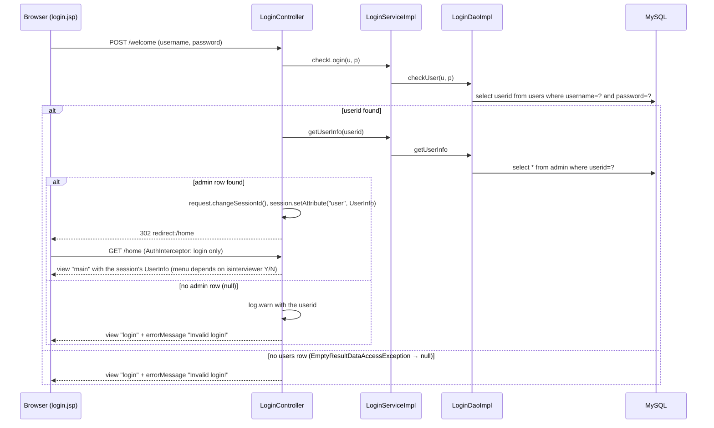

# Flow: Login / Session

Purpose: Traces the login, role-based menu and logout.
Last updated: 2026-10-01 (small fixes batch: login redirects to `/home`, `GET /` and `/home`, users without an `admin` row refused, cookie-only sessions, serializable user). 2026-09-30 (G11 login check; G27 profile escaping)
Read this when: you're fixing login or logout, the role-based menu, or session handling.

Evidence: `rms/controller/LoginController.java`, `rms/config/AuthInterceptor.java`, `rms/service/LoginServiceImpl.java`, `rms/dao/LoginDaoImpl.java`, `WEB-INF/jsp/login.jsp`, `main.jsp`, `WEB-INF/web.xml`.

```mermaid
sequenceDiagram
  participant B as Browser (login.jsp)
  participant C as LoginController
  participant S as LoginServiceImpl
  participant D as LoginDaoImpl
  participant DB as MySQL
  B->>C: POST /welcome (username, password)
  C->>S: checkLogin(u, p)
  S->>D: checkUser(u, p)
  D->>DB: select userid from users where username=? and password=?
  alt userid found
    C->>S: getUserInfo(userid)
    S->>D: getUserInfo
    D->>DB: select * from admin where userid=?
    alt admin row found
      C->>C: request.changeSessionId(), session.setAttribute("user", UserInfo)
      C-->>B: 302 redirect:/home
      B->>C: GET /home (AuthInterceptor: login only)
      C-->>B: view "main" with the session's UserInfo (menu depends on isinterviewer Y/N)
    else no admin row (null)
      C->>C: log.warn with the userid
      C-->>B: view "login" + errorMessage "Invalid login!"
    end
  else no users row (EmptyResultDataAccessException → null)
    C-->>B: view "login" + errorMessage "Invalid login!"
  end
```

## Notes
- **Entry points:** `GET /` redirects to `/home` (`LoginController.java:26-29`). `/` and `/home` need only a login, so logged out they redirect to `/login` (`WebConfig.java:50`). `GET /login` shows `login.jsp`.
- **Login page and logout:** `GET /login` invalidates the session and shows `login.jsp`. The Logout link in `main.jsp:71` points to `login` (`LoginController.loginPage`, `:31-37`); it's still a GET (G32).
- **Role-based menu:** `main.jsp` shows the admin menu when `isinterviewer` is `N` (`main.jsp:42`) and the interviewer menu when it is `Y` (`:67`). Both comparisons are null-safe, so a NULL role shows only Logout (G16). The header shows the name, role and e-mail (`main.jsp:81,84,87`).
- **Password check:** the password is compared as plain text in SQL (`LoginDaoImpl.listallusers`, `LoginDaoImpl.java:19`).
- **Failed login:** it renders `login` again at `POST /welcome` with "Invalid login!", after invalidating the session (`LoginController.java:58-63`). A refresh of that page re-posts the credentials (the one G30 case left). A `users` row without an `admin` row is refused the same way, with a WARN naming the userid (`LoginController.java:47-50`, G26).
- **Session use:** the `user` session attribute is checked before every page except `/login`, `/welcome` and `/resources/**` (`AuthInterceptor`, since 2026-09-30):
  - **Logged out** (no session, a logged-out one, or an expired one): redirect to `/login`. A page opened from the menu then shows the login form inside the content area (`acceptance/after-g11/session-expired-in-menu.png`). The form posts with `target="_top"` (`login.jsp:31`), so logging in there reloads the whole window.
  - **Interviewer, or `isinterviewer` NULL:** HTTP 403 on every page except `/home`, because all current pages are admin pages. The interviewer menu still shows; its links lead to unbuilt modules (G5).
  - **Caching:** pages behind the login send `Cache-Control: no-store` (`AuthInterceptor.java:50`).
  - The controllers themselves still don't read the session for access decisions (`rms/controller/*`); `home` only passes the session's user to `main.jsp` (`LoginController.java:67-72`).
- **Session id and cookie:**
  - The id changes at login: `request.changeSessionId()` (`LoginController.java:54`), so an id set before login is worthless (verified on Tomcat 11).
  - Sessions are tracked by cookie only (`web.xml:22`, G41): no `;jsessionid` in URLs or logs. The cookie is `JSESSIONID`, `HttpOnly`, `SameSite=Lax` (`web.xml:15-23`). It isn't `Secure`; see open question #14.
  - `UserInfo` is `Serializable` (`UserInfo.java:6`, G36). Tomcat 11's default doesn't persist sessions. Persisting them is an ops choice, with the data-protection note in [build-run.md](../build-run.md).
- **User object:** `doLogin` keeps the `UserInfo` in a local variable (`LoginController.java:47`). Until 2026-09-30 it was an instance field shared across requests, because the controller is a singleton (G12).
- **Known gaps** (details in [gaps.md](../gaps.md)):
  - G11: fixed 2026-09-30 with an interim interceptor (two registrations since 2026-10-01); Spring Security 7 later.
  - G12: shared field, fixed 2026-09-30.
  - G13: plain-text password.
  - G16: fixed 2026-10-01 (null-safe role and status checks).
  - G25: fixed 2026-10-01 (`/` → `/home`).
  - G26: fixed 2026-10-01 (no `admin` row → "Invalid login!").
  - G27: fixed 2026-09-30. The profile header in `main.jsp` is escaped with `<c:out>`, and a NULL column shows blank instead of "null".
  - G30: fixed 2026-10-01 (redirect to `/home`, new session id, context-path fallback). Left: a failed login still renders at `POST /welcome`.
  - G32: no CSRF token; logout is a GET.
  - G36: fixed 2026-10-01 (`UserInfo` is `Serializable`).
  - G41: fixed 2026-10-01 (cookie-only sessions).
