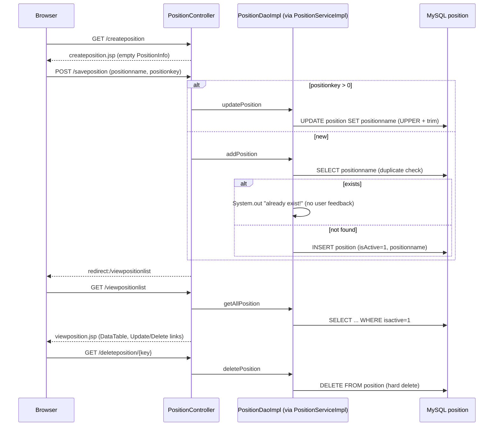

# Flow: Position & Language Masters

Purpose: Traces create, list, update and delete for the job-position and language/skill lists.
Last updated: 2026-09-25
Read this when: you're fixing or extending position or language management, or adding a new list screen that follows the same pattern.

Evidence:
- Position: `rms/controller/PositionController.java`, `rms/service/PositionServiceImpl.java`, `rms/dao/PositionDaoImpl.java`, `WEB-INF/jsp/createposition.jsp`, `viewposition.jsp`.
- Language (identical pattern): `LanguageController`, `LanguageServiceImpl`, `LanguageDaoImpl`, `createlanguage.jsp`, `viewlanguage.jsp`, table `language`.

## Endpoints
| Action | Position | Language | Handler |
|---|---|---|---|
| New form | `GET /createposition` | `GET /createlanguage` | `create*()` → `create*.jsp` |
| Save (create or update) | `POST /saveposition` | `POST /savelanguage` | `save()` → redirect to list |
| List | `GET /viewpositionlist` | `GET /viewlanguagelist` | `view*()` → `view*.jsp` |
| Edit form | `GET /updateposition/{positionkey}` | `GET /updatelanguage/{languagekey}` | `update()` → `create*.jsp` prefilled |
| Delete | `GET /deleteposition/{positionkey}` | `GET /deletelanguage/{languagekey}` | `delete()` → redirect to list |

## Notes
- **Duplicates:** a duplicate name on create is silently skipped. The update path doesn't check for duplicates (`*DaoImpl.update*`).
- **Missing key:** `findPositionById` and `findLanguageById` fail with an unhandled error if the key doesn't exist (`queryForObject`).
- **Known gaps** (details in [gaps.md](../gaps.md)):
  - G14: duplicate saves fail silently, and the JSP alerts are never set.
  - G15: missing key.
  - G17: hard delete via GET.
  - G18: update doesn't check for duplicates.
  - G27: names shown unescaped (XSS).
  - G28: no validation, so blank names are saved.
