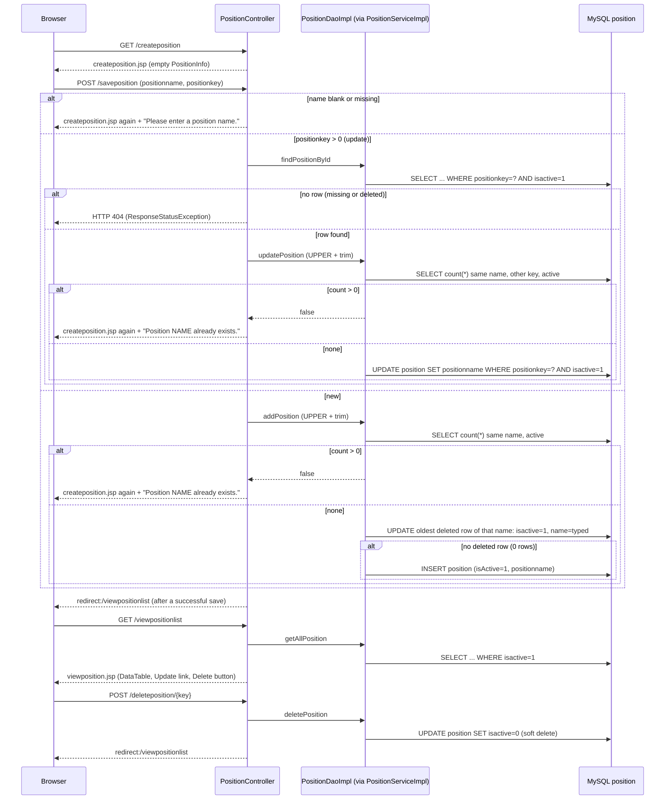

# Flow: Position & Language Masters

Purpose: Traces create, list, update and delete for the job-position and language/skill lists.
Last updated: 2026-10-01 (small fixes batch: validation and duplicate messages, soft delete as POST, reactivation, 404 for a missing or deleted key). 2026-09-30 (G27 fixed)
Read this when: you're fixing or extending position or language management, or adding a new list screen that follows the same pattern.

Evidence:
- Position: `rms/controller/PositionController.java`, `rms/service/PositionServiceImpl.java`, `rms/dao/PositionDaoImpl.java`, `WEB-INF/jsp/createposition.jsp`, `viewposition.jsp`.
- Language (identical pattern): `LanguageController`, `LanguageServiceImpl`, `LanguageDaoImpl`, `createlanguage.jsp`, `viewlanguage.jsp`, table `language`.

```mermaid
sequenceDiagram
  participant B as Browser
  participant C as PositionController
  participant D as PositionDaoImpl (via PositionServiceImpl)
  participant DB as MySQL position
  B->>C: GET /createposition
  C-->>B: createposition.jsp (empty PositionInfo)
  B->>C: POST /saveposition (positionname, positionkey)
  alt name blank or missing
    C-->>B: createposition.jsp again + "Please enter a position name."
  else positionkey > 0 (update)
    C->>D: findPositionById
    D->>DB: SELECT ... WHERE positionkey=? AND isactive=1
    alt no row (missing or deleted)
      C-->>B: HTTP 404 (ResponseStatusException)
    else row found
      C->>D: updatePosition (UPPER + trim)
      D->>DB: SELECT count(*) same name, other key, active
      alt count > 0
        D-->>C: false
        C-->>B: createposition.jsp again + "Position NAME already exists."
      else none
        D->>DB: UPDATE position SET positionname WHERE positionkey=? AND isactive=1
      end
    end
  else new
    C->>D: addPosition (UPPER + trim)
    D->>DB: SELECT count(*) same name, active
    alt count > 0
      D-->>C: false
      C-->>B: createposition.jsp again + "Position NAME already exists."
    else none
      D->>DB: UPDATE oldest deleted row of that name: isactive=1, name=typed
      alt no deleted row (0 rows)
        D->>DB: INSERT position (isActive=1, positionname)
      end
    end
  end
  C-->>B: redirect:/viewpositionlist (after a successful save)
  B->>C: GET /viewpositionlist
  C->>D: getAllPosition
  D->>DB: SELECT ... WHERE isactive=1
  C-->>B: viewposition.jsp (DataTable, Update link, Delete button)
  B->>C: POST /deleteposition/{key}
  C->>D: deletePosition
  D->>DB: UPDATE position SET isactive=0 (soft delete)
  C-->>B: redirect:/viewpositionlist
```

## Endpoints
| Action | Position | Language | Handler |
|---|---|---|---|
| New form | `GET /createposition` | `GET /createlanguage` | `create*()` → `create*.jsp` |
| Save (create or update) | `POST /saveposition` | `POST /savelanguage` | `save()` → redirect to list, or the form again with `errorMessage` |
| List | `GET /viewpositionlist` | `GET /viewlanguagelist` | `view*()` → `view*.jsp` |
| Edit form | `GET /updateposition/{positionkey}` | `GET /updatelanguage/{languagekey}` | `update()` → `create*.jsp` prefilled; 404 if missing or deleted |
| Delete (soft) | `POST /deleteposition/{positionkey}` | `POST /deletelanguage/{languagekey}` | `delete()` → redirect to list; a GET gets 405 |

Lines: `PositionController.java:27-34,36-61,63-70,72-85,87-93`; `LanguageController.java:27-34,36-43,45-70,72-85,87-93`.

## Notes
- **Validation:** a blank, whitespace-only or missing name shows the form again with `Please enter a position name.` / `Please enter a language name.` (`PositionController.java:40-43`, `LanguageController.java:49-52`). There's no length check (column length unknown, G22).
- **Duplicates:** add and update refuse a name used by another **active** row. The form is shown again with the entered value kept and `Position NAME already exists.` / `Language NAME already exists.`, where NAME is the upper-cased, trimmed name (`PositionController.java:55-57`, `LanguageController.java:64-66`; the alert is `createposition.jsp:28-34`, `createlanguage.jsp:29-35`). The DAO check is `select count(*) … and isactive=1` (`PositionDaoImpl.java:25-26`, `LanguageDaoImpl.java:27-28`). Names are compared with `=`, so the database collation decides whether accents and case matter (open question #22).
- **Concurrency:** `addPosition`, `updatePosition` and the language equivalents are `synchronized` (`PositionDaoImpl.java:56,74`, `LanguageDaoImpl.java:66,100`), which covers one Tomcat only. There's no unique index (G33, G22).
- **Soft delete:** delete sets `isactive=0` (`PositionDaoImpl.java:31`, `LanguageDaoImpl.java:33`). The row stays, so candidates that point at it still show in Candidate Status ([evaluation.md](evaluation.md)). Owner decision 2026-10-01 (open question #5).
- **Reactivation:** adding a name that only exists on deleted rows reactivates the oldest deleted row (`order by key limit 1`) and stores the typed name (`PositionDaoImpl.java:27,85-89`, `LanguageDaoImpl.java:29,77-81`). Candidates that pointed at that row point at the re-added name again. A new row is inserted only when no deleted row has the name.
- **Rename onto a deleted name:** allowed, because the update check counts active rows only (`PositionDaoImpl.java:26`, `LanguageDaoImpl.java:28`; open question #24).
- **Missing or deleted key:** `findPositionById` and `findLanguageById` return `null` for it (`PositionDaoImpl.java:102-112`, `LanguageDaoImpl.java:85-95`). The edit form answers 404, and so does saving a form whose row was deleted meanwhile (`PositionController.java:46-50,78-80`, `LanguageController.java:55-59,78-80`). The DAO update itself writes nothing for such a key and still returns `true` (the SQL has `and isactive=1`; pinned by `*DaoImplTest.updateLeavesDeletedOrMissing*`), so a delete between the controller's check and the update is skipped silently.
- **Delete as a form:** the list pages render Delete as a small POST form with a link-style button (`viewposition.jsp:55-60`, `viewlanguage.jsp:55-60`). There's no CSRF token (G32).
- **Known gaps** (details in [gaps.md](../gaps.md)):
  - G14, G15, G17, G18: fixed 2026-10-01 (duplicate feedback, 404, soft delete via POST, duplicate check on update).
  - G27: fixed 2026-09-30. The list pages escape names with `<c:out>`, and the edit form's `form:input` escapes by default. Non-Latin names stored as `&#…;` codes (G34) now show as codes.
  - G28: partly fixed. Blank names are refused; there's no length check.
  - G33: partly fixed. The count query and `synchronized` remove the 500 and the single-node race; a second node can still race, and a `UNIQUE` index is the owner's call.
