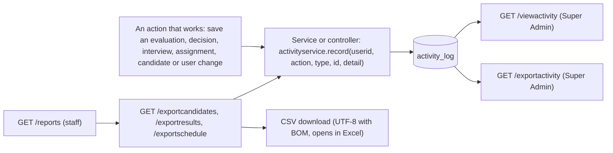

# Flow: Reports, Activity Log and English-only Text

Purpose: Traces the CSV reports, the activity log (who marked, selected, rejected and so on) and the English-only rule for entered text.
Last updated: 2026-10-03 (second round: sign-ins, documents, jobs and master data logged; Deleted Candidates page; new:  owner request after roles plan Phase 4; migration 007, DB-verified NO; G34 closed by decision)
Read this when: you're working on a report or CSV download, the Activity Log page, `activity_log`, or any check that refuses non-English text.

Evidence: `rms/controller/ReportController.java`, `ActivityController.java`; `rms/service/ActivityServiceImpl.java`, `CsvWriter.java`, `EnglishText.java`; `rms/dao/ActivityDaoImpl.java`; `rms/model/ActivityInfo.java`; `WEB-INF/jsp/reports.jsp`, `viewactivity.jsp`; `db/migrations/007-activity-log.sql`; `rms/config/SecurityConfig.java`.

## Reports (`ReportController`)
| Report | URL | Who | Columns |
|---|---|---|---|
| The page with the links | `GET /reports` | Super Admin, HR, Hiring Manager | |
| Candidates | `GET /exportcandidates` | same | ID, names, position, language, e-mail, phone, source, applied date, status, decision date, decided by, reason |
| Candidate Status | `GET /exportresults` | same | ID, names, position, language, evaluations, the average of each of the 10 criteria, the total, status |
| Interview Schedule | `GET /exportschedule` | same | time (server time), candidate, interviewer, location, status |
| Activity Log | `GET /exportactivity` | Super Admin only | time, user, action, record, detail (the newest 500) |

Interviewers get HTTP 403 for all of them (deny by default; `SecurityConfigTest.pages()` pins every role against every URL).

- **Format (`CsvWriter`):** UTF-8 with a byte order mark (Excel reads it as UTF-8), CRLF line ends, cells with a comma, quote or line break quoted. A cell that starts with `=`, `+`, `-`, `@`, a tab or a line break gets a leading apostrophe, so Excel shows it as text and never runs it as a formula (CSV injection). Phone numbers that start with `+` therefore show with an apostrophe in the file.
- **Download:** an attachment named `<report>-<date>.csv`, `Cache-Control: no-store`.
- **Content:** the same data the matching pages show (the Candidate Status averages are rounded to one decimal, like the page). No documents, passwords or hashes.
- **Logged:** every download writes `REPORT_DOWNLOADED` (the report name, never the content) and an INFO line with the key.

## Activity log (`ActivityServiceImpl`, table `activity_log`, migration 007)
Written after the action worked, so a refused action leaves no entry. `record` never throws: if the table is missing (migration 007 not run), it logs one WARN with the exception class and the user's action carries on.

| Action | When | Record | Detail |
|---|---|---|---|
| `MARKED` | an interviewer saves an evaluation (`MarksServiceImpl`) | CANDIDATE id | `total <n>` (the sum of the 10 scores, never the scores or comments) |
| `SELECTED`, `REJECTED`, `ON_HOLD` | HR or Super Admin saves a decision (`DecisionServiceImpl`) | CANDIDATE id | none (the reason is in `candidate_decision`) |
| `ASSIGNED`, `UNASSIGNED` | an interviewer is assigned or removed (`AssignmentServiceImpl`) | CANDIDATE id | `interviewer <userid>` |
| `INTERVIEW_SCHEDULED` | a new interview (`ScheduleServiceImpl`) | CANDIDATE id | `interviewer <userid>` |
| `INTERVIEW_CHANGED`, `INTERVIEW_CANCELLED` | a change or cancel (`ScheduleServiceImpl`) | INTERVIEW key | candidate and status |
| `CANDIDATE_ADDED`, `CANDIDATE_CHANGED`, `CANDIDATE_DELETED` | `CandidateController` | CANDIDATE id | none |
| `USER_ADDED`, `USER_CHANGED`, `USER_DEACTIVATED`, `USER_REACTIVATED`, `PASSWORD_RESET` | `UserController` | USER id | `role <ROLE>` on add and change |
| `REPORT_DOWNLOADED` | `ReportController` | REPORT name | none |
| `LOGIN` | a successful sign-in (`SecurityConfig.LoginSuccessHandler`) | USER id | none |
| `LOGIN_FAILED` | a wrong password or unknown user (`SecurityConfig.loginFailed`; not a database error) | USER, no id | `username <name>` only when the typed name looks like a username (3 to 100 letters, digits or . _ @ -), so a password typed in the wrong box is never logged |
| `DOCUMENT_UPLOADED` | `DocumentServiceImpl.upload` | CANDIDATE id | `document <key>, <KIND>` |
| `DOCUMENT_DELETED` | HR or Super Admin deletes a document (the file stays) | DOCUMENT key | none |
| `DOCUMENTS_PURGED` | a Super Admin deletes files permanently (also for a deleted candidate) | CANDIDATE id | `<n> files` (the reason is on the document rows) |
| `JOB_ADDED`, `JOB_CHANGED`, `JOB_DELETED` | `JobController` | JOB key (none on add) | `position <key>` on add |
| `POSITION_SAVED`, `POSITION_DELETED`, `LANGUAGE_SAVED`, `LANGUAGE_DELETED` | `PositionController`, `LanguageController` | POSITION or LANGUAGE key (none on add) | the name on save |

Not logged: sign-outs, the user's own password changes, and viewing pages. Add them the same way if wanted ([open-questions.md](../open-questions.md) #31).

- **Page:** `GET /viewactivity` (Super Admin only) shows the newest 500 entries, newest first, with an action filter (`?action=SELECTED`) and a CSV link. The user's name comes by subquery, so an entry still lists after its user is removed.
- **Table:** `activity_log` (`activitykey`, `userid`, `action`, `entitytype`, `entityid`, `detail`, `createdat`); no foreign keys; RMS only inserts and selects, never updates or deletes a row. It grows with use; archiving is by hand, outside RMS.
- **Time:** the MySQL server's wall-clock time (`now()`), like the interview schedule.
- **Privacy:** the detail holds codes and keys only: never names, e-mails, comments, reasons or scores.

## English only (`EnglishText`)
Owner decision 2026-10-03: only English is accepted, so non-Latin names (G34) are refused instead of being stored as unreadable codes. Printable ASCII only (letters, digits and common punctuation); line breaks and tabs are also allowed in multi-line fields.

| Field | Where it is checked |
|---|---|
| Candidate first and last name | `CandidateController.check` |
| User first and last name, designation | `UserController.checkProfile` |
| Position name, language name | `PositionController.save`, `LanguageController.save` |
| Decision reason | `DecisionServiceImpl.saveDecision` |
| Evaluation overall comment and criterion comments | `MarksServiceImpl.saveEvaluation` |
| Interview location | `ScheduleServiceImpl.save` |

The message says what to change: "… can use English letters only. Please use English letters, digits and common punctuation only." Existing rows with other characters stay as they are, but editing such a candidate or user needs the name fixed first. Accented Latin letters (for example é) count as not English. The e-mail and phone checks were already ASCII-only.

## Deleted Candidates (Super Admin)
- `GET /viewdeletedcandidates` lists the deleted candidates with the number of document files still stored. For each one with files left, a Super Admin enters a reason and deletes them permanently (`POST /purgedocuments`, the same action as on a profile; the reason is required and English only). The page then returns to the list with the result. Menu: Administration > Deleted Candidates.
- **Retention:** RMS never deletes files by itself and sets no retention period. The owner decides how long files are kept; a Super Admin applies it by hand from this page, and each purge is in the activity log (`DOCUMENTS_PURGED`). The activity log has no retention rule either: it grows with use, and old rows are archived or purged by hand, outside RMS ([open-questions.md](../open-questions.md) #31).

## Interview times in the past
`ScheduleServiceImpl.save` refuses a SCHEDULED interview whose time has already passed when it is new or its time changes: "Please choose a time that hasn't passed yet." A change that keeps the stored time, and an interview marked Done, are not checked, so a past interview can still get a location or be marked Done. Times stay the database server's wall-clock time.

## Not built (open)
- E-mail or calendar notifications for interviews: the owner will decide later ([open-questions.md](../open-questions.md) #10).
- A retention period for the activity log and for documents: the owner decides ([open-questions.md](../open-questions.md) #31).
- Excel (`.xlsx`) and PDF output: only CSV.
