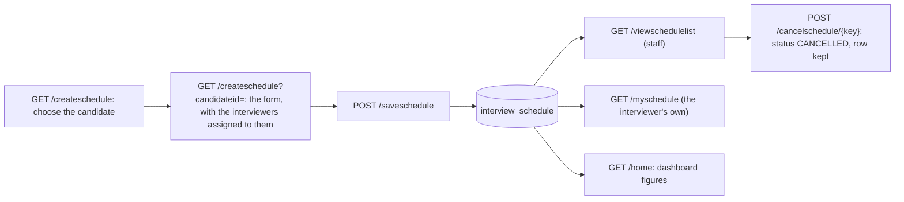

# Flow: Interview Schedule and Dashboard

Purpose: Traces scheduling an interview, the schedule lists, and the figures on the home page (the dashboard).
Last updated: 2026-10-03 (Phase 4 of the roles plan: new; G3 fixed; migration 006, DB-verified NO)
Read this when: you're working on interview scheduling, the Interview Schedule or My Schedule pages, or the home page dashboard.

Evidence: `rms/controller/ScheduleController.java`, `LoginController.java` (`home`); `rms/service/ScheduleServiceImpl.java`, `DashboardServiceImpl.java`; `rms/dao/ScheduleDaoImpl.java`, `DashboardDaoImpl.java`; `rms/model/ScheduleInfo.java`, `DashboardInfo.java`; `WEB-INF/jsp/viewschedule.jsp`, `myschedule.jsp`, `createschedule.jsp`, `main.jsp`; `WEB-INF/tags/schedulestatus.tag`, `layout.tag`; `rms/config/SecurityConfig.java`; `db/migrations/006-interview-schedule.sql`; tests `ScheduleControllerTest`, `ScheduleServiceImplTest`, `DashboardServiceImplTest`, `ScheduleModelTest`, `ScheduleDaoImplTest`, `DashboardDaoImplTest`, `SecurityConfigTest`, `LoginControllerTest`.

## Endpoints and access (`SecurityConfig`)
| Action | URL | Who |
|---|---|---|
| The whole schedule | `GET /viewschedulelist` | Super Admin, HR, Hiring Manager (read-only for the Hiring Manager) |
| Schedule an interview | `GET /createschedule` (choose the candidate), `GET /createschedule?candidateid=` (the form), `POST /saveschedule` | Super Admin, HR |
| Change an interview | `GET /updateschedule/{schedulekey}`, `POST /saveschedule` | Super Admin, HR |
| Cancel an interview | `POST /cancelschedule/{schedulekey}` | Super Admin, HR |
| My Schedule | `GET /myschedule` | Interviewer only; the user is the session's, so no request parameter can show another's schedule |

Anyone else gets HTTP 403 (deny by default); `SecurityConfigTest.pages()` pins every role against every URL.

## Rules (`ScheduleServiceImpl.save`)
- **Interviewer:** a new interview, or a change that picks a different interviewer, needs one assigned to the candidate now and active (account active and the Interviewer role, the same test as the assignment list). The form offers only those; the service checks again. A change that keeps the stored interviewer needs no check, so an interview can still be marked Done or given a place after its interviewer was unassigned or deactivated; the edit form then lists them as "(not assigned now)". Such an interviewer no longer sees that interview on My Schedule or in their dashboard (their queries require an active assignment); staff still see it and can cancel it.
- **Time:** required, cut to whole minutes (seconds are dropped, so the double-booking check compares minutes). It is a `DATETIME` with **no time zone**: the form's `datetime-local` value is stored as typed, and RMS compares it with `NOW()` ("upcoming"), which is the MySQL server's time zone. Users enter, and the pages show, the server's local time ([migration 006](../../db/migrations/006-interview-schedule.sql)). Past times are accepted (to record an interview), and they are not "upcoming".
- **Location:** optional, trimmed, at most 200 characters; blank is stored as NULL.
- **Double booking:** an interviewer can't have two `SCHEDULED` interviews at exactly the same start time. Cancelled and done interviews don't block a time. The check and the write are `synchronized` (one Tomcat); on two nodes two HR users could still book the same minute.
- **Status:** a new interview is always `SCHEDULED`. A change may set `SCHEDULED` or `DONE`. **Cancel** is its own POST and works only on a `SCHEDULED` interview; it sets `CANCELLED` and keeps the row, so the list shows what happened. A cancelled interview can't be edited (the edit URL redirects to the list with a message). Nothing marks an interview `DONE` automatically.
- **Candidate:** must exist and be active (HTTP 404 otherwise). On a change the candidate comes from the stored row, not from the post, and only the form's fields bind (`@InitBinder`). Interviews of a deleted candidate are hidden.
- **Two steps without script:** `/createschedule` without a candidate shows a GET form to choose one; with `?candidateid=` it shows the interview form. The ID is free text (G22), so it travels as a query parameter.
- `isactive` on the table is reserved for hiding a row; nothing sets it to 0 yet.
- **Logging:** keys only (schedule, candidate, interviewer and user IDs), never names or locations.

## Lists
- **Interview Schedule** (`viewschedule.jsp`): every interview by start time with candidate (linked to the profile), interviewer, location and a status badge (`schedulestatus.tag`); Edit and Cancel (a POST with a confirm prompt) for Super Admin and HR.
- **My Schedule** (`myschedule.jsp`): the same without the actions, for the signed-in interviewer.

## Dashboard (home page)
`LoginController.home` asks `DashboardService.getDashboard(role, userid)` and puts the result in the model as `dashboard`; `main.jsp` shows it above the tiles. If the figures can't be read (for example migration 006 has not run), the failure is logged as a WARN and the home page still opens without them. A user without a role gets none.

| Figure | Definition (`DashboardDaoImpl`) | Who |
|---|---|---|
| Candidates by status | Active candidates grouped by the trimmed, upper-case `candidatestatus`: S Selected, R Rejected, H On hold; NULL or any other text is Pending (as `DecisionStatus.labelOf`) | staff |
| Evaluations still to do | Pairs of an active assignment to an active interviewer and a candidate that is **not** Selected or Rejected, where that interviewer has no active evaluation (`count(distinct candidateid, interviewerid)`, so a double assignment counts once) | staff: all; Interviewer: their own |
| Upcoming interviews | `SCHEDULED` interviews with `startat >= NOW()` of active candidates; the next 5 are listed | staff: all; Interviewer: their own |
| Open jobs | `job` rows with `status = 'OPEN'` and `isactive = 1` (nothing closes a job automatically) | staff |
| Candidates with no CV | Active candidates with no `candidate_document` of type CV that is active and not purged | staff |
| Candidates with an inactive interviewer | Candidates not Selected or Rejected that have an active assignment to an interviewer whose account is inactive or who no longer has the Interviewer role | staff |

The cards link to Candidate Status, the candidate, schedule and job lists, and My Evaluations or My Schedule.

## Menu and tiles
`layout.tag` shows **Interview Schedule** (`active` key `schedule`) under Recruitment to Super Admin, HR and Hiring Manager, and **My Schedule** (`myschedule`) to Interviewers. The disabled "Coming soon" entry and tile are gone.

## Not built (open)
- No notification (e-mail, calendar invite) to the interviewer or the candidate ([open-questions.md](../open-questions.md) #10).
- No link from the candidate profile to the schedule, and no history of changes beyond `updatedby` and `updatedat` on the row.
- No overlap check for different start times, no check that the time is in the future, and no automatic DONE.
- The DAO tests, the JSPs and migration 006 have not run against a real MySQL or on Tomcat ([../acceptance/roles-phase4.md](../acceptance/roles-phase4.md)).
