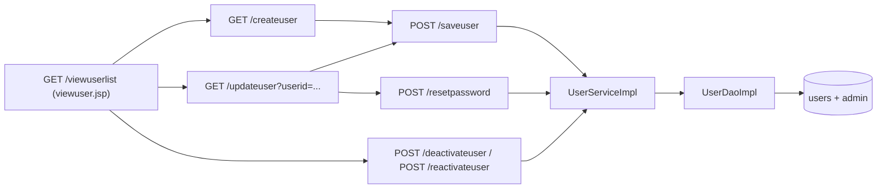

# Flow: Users, Roles and Passwords

Purpose: Traces the four roles, the Users and Roles screen, Change password and the login lock.
Last updated: 2026-10-02 (Phase 3: interviewer pages and the assigned-candidate checks; a deactivated interviewer's assignments stay, flagged). 2026-10-02 (Phase 2: the access rules for jobs, the candidate profile and documents). 2026-10-02 (Phase 1 of the roles plan: roles, Users and Roles, Change password, bcrypt for new passwords, inactive users, login lock; migrations 002 and 003)
Read this when: you're changing who can open what, managing users, or working on passwords and the login lock. The login itself is in [login.md](login.md).

Evidence: `rms/model/Role.java`, `rms/config/SecurityConfig.java`, `rms/config/AccountCheckFilter.java`, `rms/config/LoginThrottle.java`, `rms/controller/UserController.java`, `rms/controller/AccountController.java`, `rms/service/UserServiceImpl.java`, `rms/dao/UserDaoImpl.java`, `rms/dao/LoginDaoImpl.java`, `WEB-INF/jsp/viewuser.jsp`, `createuser.jsp`, `changepassword.jsp`, `WEB-INF/tags/layout.tag`. Tests: `SecurityConfigTest` (access matrix), `UserControllerTest`, `AccountControllerTest`, `UserServiceImplTest`, `UserDaoImplTest` (needs Docker), `LoginThrottleTest`, `RoleTest`.

## Roles
| Role | Stored as `admin.role` | Can open | `admin.isinterviewer` written |
|---|---|---|---|
| Super Admin | `SUPER_ADMIN` | everything, including Users and Roles | `N` |
| HR | `HR` | Candidate Status, candidates (add, edit, delete, profile, documents), jobs, positions, languages | `Y` |
| Hiring Manager | `HIRING_MANAGER` | Candidate Status, the candidate list and profiles, jobs, document downloads; read-only | `Y` |
| Interviewer | `INTERVIEWER` | My Evaluations and the evaluation form for their assigned candidates, those candidates' profiles and documents | `Y` |

- **Every logged-in user**, with or without a role, can open Home and Change password.
- **Where the role comes from** (`Role.of`, read in `LoginDaoImpl.UserMapper` and `UserDaoImpl.UserMapper`): `admin.role`; when that is NULL, the legacy `admin.isinterviewer` (`N` → Super Admin, `Y` → Interviewer). Anything else, including an unknown `role` text, is **no role**: the user sees only Home and Change password (fail closed, G16).
- **Why `isinterviewer` is still written:** so a rollback to a WAR from before the roles keeps working. HR and Hiring Manager are written as `Y`, not NULL, because the released WAR's `main.jsp` calls `getIsinterviewer().equalsIgnoreCase(…)` and fails with HTTP 500 on NULL (`git show d535f1c:src/main/webapp/WEB-INF/jsp/main.jsp`, line 43). With `Y` they get the old interviewer menu and no admin pages (that WAR's `AuthInterceptor` admits only `N`).
- **One role per user.** A hiring manager who also interviews needs two accounts for now.

## Access rules (`SecurityConfig.appFilterChain`)
- `/login`, `/welcome`: public. `/`, `/home`, `/changepassword`, `/savepassword`: any logged-in user.
- `USER_ADMIN_PAGES` (Users and Roles): Super Admin.
- `SUPER_ADMIN_PAGES` (`/purgedocuments`, the permanent delete of a candidate's document files): Super Admin.
- `STAFF_READ_PAGES` (`/adminviewmarks`, `/viewcandidatelist`, `/viewevaluations`, `/viewjoblist`): Super Admin, HR, Hiring Manager.
- `CANDIDATE_READ_PAGES` (`/viewcandidate`, `/downloaddocument/*`): all four roles; an interviewer only for candidates assigned to them, checked in `CandidateController` and `DocumentController` (403 otherwise).
- `INTERVIEWER_PAGES` (`/myevaluations`, `/evaluate`, `/saveevaluation`): Interviewer; the assignment is checked in `EvaluationController`.
- `HR_PAGES` (candidate, document, assignment and decision changes, jobs, positions, languages): Super Admin, HR.
- **Everything else is refused** (`anyRequest().denyAll()`), including pages that don't exist and `/x/` for `/x`: HTTP 403 when logged in, a redirect to `/login` when not. A new page needs its own rule and cases in `SecurityConfigTest.pages()`.
- The candidate list hides Add, Edit and Delete from a Hiring Manager (`viewcandidate.jsp`, `canedit`); the URLs behind them are refused anyway.

## Users and Roles (Super Admin)

- **List:** every `admin` row, active or not, with its username, role, designation and status (Active / Inactive, "Must change password"). An `admin` row without a `users` row shows "No login". IDs sort as numbers (U2 before U10).
- **Add:** username (3–100 of letters, digits, `. _ @ -`), first and last name, optional e-mail, phone and designation, a role, and a temporary password typed twice.
  - RMS generates the user ID as `U` plus the next number after the highest `U<number>` ID (up to 9 digits) in `users`, `admin` **and** `marks.interviewerid`, so a new user never takes an ID that already has a login, a profile or evaluations. Other ID formats are ignored.
  - The `users` and `admin` rows are written in one transaction (`UserDaoImpl.addUser`, `TransactionTemplate`). On a clash on the key it retries with the next number, up to 3 times.
  - A username used by any `users` row is refused ("That username is already taken."), compared under the column's collation (case-insensitive on the MySQL defaults), deactivated users included.
  - The new user must choose their own password at first login (`users.mustchangepassword = 1`).
- **Edit:** profile and role. The user ID and username can't be changed. Posted `isactive`, `mustchangepassword` and the like are ignored (`UserController.bindProfileFieldsOnly`).
- **Deactivate / Reactivate:** soft. Deactivating sets `admin.isactive = 0`, which blocks the login and ends the user's open session at their next request. Nothing else changes: their evaluations, schedules and history stay, and their open candidate assignments stay too, flagged "interviewer inactive" on the profile and the evaluation detail for HR (Phase 3; the dashboard flag comes in Phase 4). Reactivating restores everything.
- **Reset password:** sets a temporary password and `mustchangepassword = 1`. The user can then open only Change password until they choose their own.
- **Guards:** a Super Admin can't deactivate, demote or reset themselves here (they use Change password), and the last active Super Admin can't be deactivated or demoted.
- **Logging:** `UserController` logs the target and acting userids at INFO (created, edited, deactivated, reactivated, password reset). No names or passwords.

## Change password (every user)
- `GET /changepassword`, `POST /savepassword` (`AccountController`): current password, new password twice.
- **Rules** (`PasswordRules.problem`, shared with Users and Roles): at least 8 characters, at most 72 bytes in UTF-8 (bcrypt's limit), the two copies equal, and different from the current one.
- The current password is checked with the same encoder as the login, so legacy plain-text rows work (`UserServiceImpl.changePassword`).
- **Wrong current passwords are counted like failed logins** (their own counts, by userid and address, cleared by a successful change): after 5 in 15 minutes the page refuses for 15 minutes ("Too many wrong passwords."). So a session left open can't be used to guess the password.

## Passwords
- **Stored form:** every new, reset or changed password is stored as `{bcrypt}` plus a 60-character hash: 68 characters (`SecurityConfig.passwordEncoder`). The login still accepts the legacy plain-text rows (G13).
- **Existing plain-text rows** stay as they are until the owner runs `db/migrations/003-hash-passwords/` (a Java program, not SQL: MySQL has no bcrypt). It is written but **not run**; see its README.
- `users.password` must hold 68 characters; migration 002 has the check.

## Inactive users and account changes
- **Login:** an inactive user (`admin.isactive` other than 1) is refused with the usual "Invalid login!". The check runs after the password check, so an inactive account doesn't answer faster than a wrong password (`SecurityConfig.authenticationProvider`: no pre-authentication checks).
- **While logged in** (`AccountCheckFilter`, before the access rules on every request): RMS reads the user's `admin` row again (one query per request).
  - Deactivated, row gone, or role changed: the session ends and the browser goes to `/login?ended` ("You were signed out because your account changed. Please sign in again.").
  - `mustchangepassword = 1`: every page except Change password (and logout) redirects to `/changepassword`.
  - Otherwise the session's `user` profile is refreshed, so name or designation edits show at once.

## Login lock (G42)
- `LoginThrottle`: 5 failed logins for one username from one address within 15 minutes lock that username for that address for 15 minutes. A successful login clears the count. The username is trimmed and folded like the default collations (case, accents, ß as ss).
- While locked, a login post is refused before the password check, with the usual "Invalid login!", so the lock doesn't reveal itself or whether the account exists.
- A database error at login doesn't count.
- The lock logs one WARN, without the username or the address (both can be personal data).
- **Limits:** the counts are in memory: each Tomcat node counts on its own, and a restart forgets them. The address is the request's remote address; behind a reverse proxy that is the proxy's, so the lock applies to the username from every address unless ops configure Tomcat's `RemoteIpValve`.

## Known limits (accepted in Phase 1, after the code review)
- **Lock key:** usernames are folded like MySQL's default collations (case, accents, ß as ss), so spellings of one account share one count (`LoginThrottle.key`). There's no per-address limit across usernames, so many usernames from one address aren't limited together; a shared office address would otherwise lock everyone.
- **Last Super Admin:** the guard checks, then writes. Two Super Admins deactivating or demoting each other at the same moment could leave none active; recovery would be a manual `UPDATE admin SET isactive=1 …` by the owner.
- **Other sessions after a password change:** changing your own password doesn't end your other open sessions. After an admin reset, an existing session can only open Change password, which needs the temporary password.
- **Change password counts** are separate from the login's (keyed by userid) and cleared by a successful change.

## Not yet verified
- The DAO tests (`UserDaoImplTest`, the new `LoginDaoImplTest` cases) were written but skipped: there's no Docker on the machine used on 2026-10-02. Manual SQL checks are in [upgrade-status.md](../upgrade-status.md).
- The three new JSPs and the menu haven't been rendered in a browser; `SmokeTest.userAndPasswordPagesRender` covers them once the WAR is deployed.

Known gaps closed or changed here: G2 (user and interviewer management), G42 (login lock), G13 (new passwords hashed; existing rows wait for 003), G21 (`admin.isactive` is read now). Details in [gaps.md](../gaps.md).
